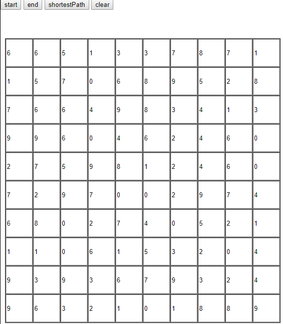
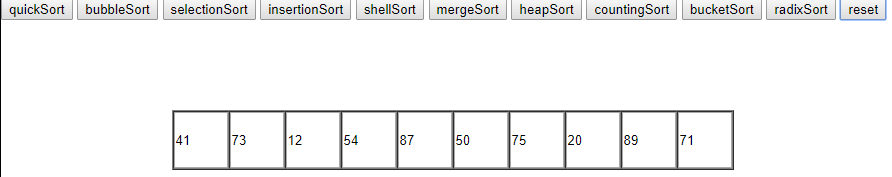
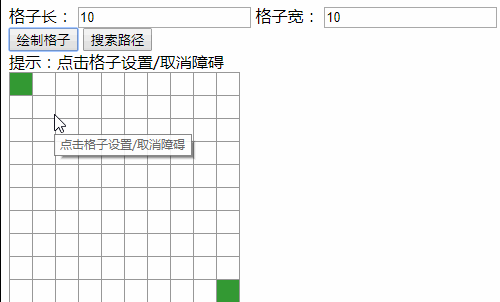
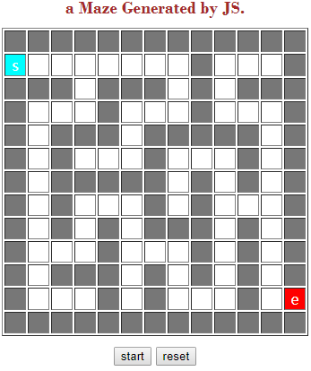
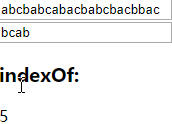
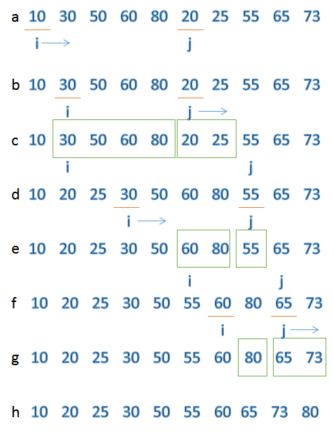

# algorithmByJS

## 最短路径算法 dijkstra(shortestPath.html)

### 运行方式

1. 自动生成随机数或手动输入数
2. 点击"start"，再点击起始方格，点击"end"，再点击结束方格，来定义起始和结束位置。
3. 点击"shortestPath"，会画出最短路径。方格数字表示经过这格的距离，数字越大，距离越大。
4. 点击"clear"会清除路线，然后可重新定义起始和结束位置。

### 图例：



## 排序算法(sort.html)

### 运行方式

1. 自动生成随机数或手动输入数
2. 点击其中一种排序算法，对数字进行排序
3. 点击"reset"重置数据
4. 感谢作者[杜少](https://www.cnblogs.com/dushao/p/6004883.html)、[凯尔宝宝](https://blog.csdn.net/xuyangxinlei/article/details/81062015)

### 图例：



## 深度优先搜索(dfs.html)

### 运行方式

1. 设置格子长款个数，绘制表格
2. 点击格子设置和取消障碍
3. 点击"搜索路径"进行搜索
4. 感谢作者[zwseaman](https://blog.csdn.net/zwseaman/article/details/7592855)

### 图例：



## 最小生成树算法 prim(prim.html)

1. 点击"start"自动寻找出路
2. 点击"reset"重置迷宫
3. 感谢作者[欧阳蒜苗](https://blog.csdn.net/scargtt/article/details/71078275)

### 图例：



## KMP 算法(kmp.html)

1. 修改 input 值
2. 感谢作者[0giant](https://www.cnblogs.com/LUO77/p/5603893.html)

### 图例：



## 算法简介

### 最短路径算法 dijkstra

- 准备信息

1. 一共有 vertex 个点
2. 起始点为第 a 个点，结束点为第 b 个点
3. 把问题模型转化为：点与点之间距离的邻接矩阵 adj[][]
4. 记录起点到每个顶点的最短路径的信息数组 dis[]
5. 信息数组 dis[]的每项信息对象 msg，path 文字记录起始点到每个点，value 记录这段路径的距离，visit 记录是否已经访问
6. 定义最远距离为 infinate

- 邻接矩阵初始化(问题模型转化)

1. 全部初始化为 infinate
2. 自身到自身距离为 0，对角线为 0
3. 计算点到点的距离，非直连点距离记为 infinate

- 初始化信息数组

1. 记录 path 为“va-->vi”
2. 根据 adj[a][i]记录 value
3. visit 除自身点为 true 以外，其余全为 false

- 计算过程

1. a 找出最近直连点 x，路径为 pathAX

具体操作为循环每一个**没访问过**的**直连**点，比较 dis[i]得出最小值，并获得序号 x，标记 x 已经访问

2. x 找出最近直连点 y，路径为 pathXY，如果有路径 pathAX + pathXY < pathAY，则更新 pathAY 距离

具体操作为循环每一个**没访问过**的**直连**点，如果 dis[x] + adj[x][i] < dis[i]，更新 dis[i]信息

3. 循环以上过程，即每一个点，使得信息数组填充完备，其中 dis[b]包含最短路径信息

- 更多操作

1. 可打印最短距离，经过的路径信息等

- 思考

1. 最短路径是 1 维寻找最小数 的 2 维版本
2. 1 维寻找最小数可实现排序，路径也可以进行排序
3. 3 维的最短路径，只需计算出周围 8 个点的路径，坐标计算变为 3 维，其余思想不变

### 排序算法

#### 快速排序

1. 思想

记录第一个数，通过调整数组，先不管排序，比它小的放左边，比它大的放右边，以它为切割点，分割成 2 个数组，重复以上操作，直到不可分割出数组

2. 操作

- 如何扫描？

```js
while (i != j) {
  while (i < j && arr[j] > temp) {
    //从右往左扫描到一个小于temp的元素
    j--;
  }
  if (i < j) {
    arr[i] = arr[j]; //把j的元素放在i的位置上（temp的左边）
    i++; //i右移一位
  }
  while (i < j && arr[i] < temp) {
    //从左往右扫描找到一个大于temp的元素
    i++;
  }
  if (i < j) {
    arr[j] = arr[i]; //把i的元素放在j的位置上(temp的右边)
    j--;
  }
}
arr[i] = temp; //将temp放在最终位置
```

- 结束条件(持续条件)

左索引大于等于右索引(左索引小于右索引)

3. 复杂度

- 时间：最优 O(nlog2n)，最差 O(n^2)，平均 O(nlog2n)
- 空间：最优 O(logn)每一次都平分数组的情况，最差 O(n)退化为冒泡排序的情况

4. 稳定性

- 不稳定

5. 优化

- 快速排序的多种写法

  - 填充法：元素比较基准值，把元素值填入当前位置

  ```js
  let quickSort = (arr, l, r) => {
    let pivot,
      left = l,
      right = r;
    if (left < right) {
      //避免栈溢出风险
      pivot = arr[left];
      while (left != right) {
        while (left < right && arr[right] > pivot) {
          right--;
        }
        if (left < right) {
          arr[left] = arr[right];
          left++;
        }
        while (left < right && arr[left] < pivot) {
          left++;
        }
        if (left < right) {
          arr[right] = arr[left];
          right--;
        }
      }
      arr[left] = pivot;
      quickSort(arr, l, left - 1);
      quickSort(arr, left + 1, r);
    }
  };
  ```

  - 交换法：元素比较基准值左右均完成后，交换左右位置

  ```js
  let quickSort = (arr, l, r) => {
    if (l < r) {
      var pivot = arr[l],
        left = l,
        right = r;
      while (left < right) {
        while (left < right && arr[right] >= pivot) {
          right--;
        }
        while (left < right && arr[left] <= pivot) {
          left++;
        }
        if (left < right) {
          let tmp = arr[left];
          arr[left] = arr[right];
          arr[right] = tmp;
        }
      }
      let tmp2 = arr[left];
      arr[left] = arr[l];
      arr[l] = tmp2;

      quickSort(arr, l, left - 1);
      quickSort(arr, left + 1, r);
    }
  };
  ```

  - 非递归法：解决数据量大导致栈溢出的问题，因此把[left,right]保存到数组

  ```js
  let quickSort = function (num, left, right) {
    let list = [[left, right]]; // 将[left,right]存入数组中，类似于递归入栈
    while (list.length > 0) {
      // 若list不为空，循环弹出list最后一个数组进行快排
      let now = list.pop(); // 弹出list末尾。(也可用list.shift()取出list第一个数组，但在数据量较大时，这种方式效率较低)
      if (now[0] >= now[1]) {
        // 若左右指针相遇，待排序数组长度小宇1，则无需进行快排(注意不能写成now[0]==now[1]，这里now[0]是有可能大于now[1]的
        continue;
      }
      let i = now[0],
        j = now[1],
        flag = now[0]; // 以下与递归方法相同，请参考上面的递归详解
      while (i < j) {
        while (num[j] >= num[flag] && j > flag) j--;
        if (i >= j) {
          break;
        }
        while (num[i] <= num[flag] && i < j) i++;
        let temp = num[flag];
        num[flag] = num[j];
        num[j] = num[i];
        num[i] = temp;
        flag = i;
      }
      list.push([now[0], flag - 1]); // 将flag左边数组作为待排序数组，只需将左右指针放入list即可。
      list.push([flag + 1, now[1]]); // 将flag右边数组作为待排序数组，只需将左右指针放入list即可。
    }
  };
  ```

- 任意基准：第一个数与随机一个数交换位置，再把第一个数作为主元，其余算法同理
- 三数(左中右)取中值作为主元：第一个数、中间数、末尾数取排第二大的数与第一个数交换位置，再把第一个数作为主元，其余算法同理

```js
let GetMid = (array, left, right) => {
  var mid = left + (right - left) / 2;

  if (array[left] <= array[right]) {
    if (array[mid] < array[left]) return left;
    else if (array[mid] > array[right]) return right;
    else return mid;
  } else {
    if (array[mid] > array[left]) return left;
    else if (array[mid] < array[right]) return right;
    else return mid;
  }
};
```

- 数组长度小到指定长度，用插入排序

#### 冒泡排序

1. 思想

相邻元素两两对比，把较大数放后面

2. 操作

```js
for (let i = 0; i < len; i++) {
  for (let j = 0; j < len - 1 - i; j++) {
    if (arr[j] > arr[j + 1]) {
      //相邻元素两两对比
      let temp = arr[j + 1]; //元素交换
      arr[j + 1] = arr[j];
      arr[j] = temp;
    }
  }
}
```

3. 复杂度

- 时间：最优 O(n)，最差 O(n^2)，平均 O(n^2)
- 空间：O(1)

4. 稳定性

- 稳定

#### 选择排序

1. 思想

随着索引移动，不断寻找最小的数，与索引处元素交换

2. 操作

```js
for (let i = 0; i < len - 1; i++) {
  minIndex = i;
  for (let j = i + 1; j < len; j++) {
    if (arr[j] < arr[minIndex]) {
      //寻找最小的数
      minIndex = j; //将最小数的索引保存
    }
  }
  temp = arr[i];
  arr[i] = arr[minIndex];
  arr[minIndex] = temp;
}
```

3. 复杂度

- 时间：最优 O(n)，最差 O(n^2)，平均 O(n^2)
- 空间：O(1)

4. 稳定性

- 不稳定

#### 插入排序

1. 思想

有一个已经有序的数据序列，要求在这个已经排好的数据序列中插入一个数，但要求插入后此数据序列仍然有序

2. 操作

```js
for (let i = 1; i < len; i++) {
  preIndex = i - 1;
  current = arr[i];
  while (preIndex >= 0 && arr[preIndex] > current) {
    arr[preIndex + 1] = arr[preIndex];
    preIndex--;
  }
  arr[preIndex + 1] = current;
}
```

3. 复杂度

- 时间：最优 O(n)，最差 O(n^2)，平均 O(n^2)
- 空间：O(1)

4. 稳定性

- 稳定

#### 希尔排序

1. 思想

递减间隔分组插入排序

2. 操作

```js
while (gap >= 1) {
  for (let i = gap; i < arr.length; i++) {
    let j,
      temp = arr[i];
    for (j = i - gap; j >= 0 && temp < arr[j]; j = j - gap) {
      arr[j + gap] = arr[j];
    }
    arr[j + gap] = temp;
  }
  gap = Math.floor(gap / 2);
}
```

3. 复杂度

- 时间：最优 O(nlog2n)，最差 O(n^2)，平均 O(n^1.5)
- 空间：O(1)

4. 稳定性

- 不稳定

#### 归并排序

1. 思想

相当于二叉树，每个根节点表示一个数，两两归并排序到其上一个节点，直到根节点完全排好

2. 操作

```js
function mergeSort(arr) {
  if (arr.length < 2) return arr;

  let middle = Math.floor(arr.length / 2);
  let arrLeft = arr.slice(0, middle);
  let arrRight = arr.slice(middle);

  return merge(mergeSort(arrLeft), mergeSort(arrRight));
}

function merge(arrLeft, arrRight) {
  // 这里arrLeft和arrRight都是排好序的数组
  let i = 0;
  let j = 0;
  let newArr = [];
  while (i < arrLeft.length && j < arrRight.length) {
    if (arrLeft[i] < arrRight[j]) {
      newArr.push(arrLeft[i]);
      i++;
    } else {
      newArr.push(arrRight[j]);
      j++;
    }
  }

  if (i === arrLeft.length) {
    //如果arrLeft已经遍历完，则直接把arrRight数组中剩余的元素放入newArr
    newArr = newArr.concat(arrRight.slice(j));
  } else {
    newArr = newArr.concat(arrLeft.slice(i));
  }
  return newArr;
}
```

3. 操作

- 细节排序方法

对比左右两个有序序列，只需比较两边第一个元素，把较小的取出并放入新数组，使归并数组有序

- 结束递归条件

数组长度为 1(二叉树分到根节点)

4. 复杂度

- 时间：最优 O(nlog2n)，最差 O(nlog2n)，平均 O(nlog2n)
- 空间：O(n)

5. 稳定性

- 稳定

6. 优化

- TimSort

检测序列中的天然有序子段，若检测到严格降序子段则翻转序列为升序子段，在最好情况下无论升序还是降序都可以使时间复杂度降至为 O(n)

- 原地归并

原本需要一个辅助数组，所以归并排序的空间复杂度是 O(n)，优化后可以进行原地排序，额外空间为 O(1)。

核心思想是“交换两段相邻内存块”。

具体操作：起始左右索引为各自的第一个元素，比较两边索引，不产生逆序，则两边索引向前走，否则，把右边产生逆序的数据段插入到左边索引之前，直到其中一个数组遍历完成。



7. 其它应用

- 逆序数对

```js
//修改上面的merge
function merge(arrLeft, arrRight) {
  let i = 0;
  let j = 0;
  let newArr = [];
  while (i < arrLeft.length && j < arrRight.length) {
    if (arrLeft[i] <= arrRight[j]) {
      //改为<=
      newArr.push(arrLeft[i]);
      i++;
    } else {
      newArr.push(arrRight[j]);
      for (var index = i; index < arrLeft.length; index++) {
        console.log("pairs:(" + arrLeft[index] + "," + arrRight[j] + ")");
      }
      //此位置的逆序数对长度为：arrLeft.length - i
      //总逆序数对：把这里出现的逆序数对累加即可
      j++;
    }
  }

  if (i === arrLeft.length) {
    //如果arrLeft已经遍历完，则直接把arrRight数组中剩余的元素放入newArr
    newArr = newArr.concat(arrRight.slice(j));
  } else {
    newArr = newArr.concat(arrLeft.slice(i));
  }
  return newArr;
}
```

#### 堆排序

1. 概念

堆实际上是一个完全二叉树，并且其左右子节点都不大于父节点（父节点大于子节点）
最大堆是父节点>左节点>右节点

父节点索引为 i，其左子节点索引为 2i+1，其右子节点索引为 2i+2

最后一个父节点的索引为 floor(length/2-1)

2. 思想

从后往前遍历一次每个父节点来构造堆(父节点>子节点)，遍历后根节点(0)一定是最大的数，与最后一个节点(length-1)交换位置，数组长度-1，接下来的操作不影响最后一个元素，重复以上操作。

3. 操作

```js
let len; //因为声明的多个函数都需要数据长度，所以把len设置成为全局变量

let buildMaxHeap = (arr) => {
  //建立大顶堆
  len = arr.length;
  for (let i = Math.floor(len / 2 - 1); i >= 0; i--) {
    heapify(arr, i);
  }
  //从最后一个父节点开始排，一旦底层排好，上层则不会产生递归，复杂度O(n)
};

let heapify = (arr, i) => {
  //堆调整
  let left = 2 * i + 1, //左节点
    right = 2 * i + 2, //右节点
    largest = i; //父节点

  if (left < len && arr[left] > arr[largest]) {
    largest = left;
  }

  if (right < len && arr[right] > arr[largest]) {
    largest = right;
  }

  if (largest != i) {
    swap(arr, i, largest);
    heapify(arr, largest); //其子节点变父节点，再次调整，只需调整被改动的半边，复杂度O(log2 n)
  }
};

let swap = (arr, i, j) => {
  let temp = arr[i];
  arr[i] = arr[j];
  arr[j] = temp;
};

let heapSort = (arr) => {
  //初始化，i从最後一个父节点开始调整
  buildMaxHeap(arr); //复杂度O(n)
  //先将第一个元素和已经排好的元素前一位做交换，再从新调整(刚调整的元素之前的元素)，直到排序完毕
  for (let i = arr.length - 1; i > 0; i--) {
    //复杂度O(n)
    swap(arr, 0, i);
    len--;
    heapify(arr, 0); //从根节点开始递归，复杂度O(log2 n)
  }
  //总复杂度O(n+nlog2 n)->O(nlog2 n)
  return arr;
};
```

测试：

```js
let heapSort = (array) => {
  let len = array.length;
  buildMaxHeap(array);
  while (len > 0) {
    swap(array, 0, len - 1);
    len--;
    heapJustify(array, 0, len);
  }
};
let buildMaxHeap = (array) => {
  let len = array.length;
  for (let i = Math.floor(len / 2 - 1); i >= 0; i--) {
    heapJustify(array, i, len);
  }
};
let heapJustify = (array, currentNodeIndex, subLength) => {
  let leftIndex = 2 * currentNodeIndex + 1;
  let rightIndex = 2 * currentNodeIndex + 2;
  let maxIndex = currentNodeIndex;
  if (leftIndex < subLength && array[leftIndex] > array[maxIndex]) {
    maxIndex = leftIndex;
  }
  if (rightIndex < subLength && array[rightIndex] > array[maxIndex]) {
    maxIndex = rightIndex;
  }
  if (maxIndex != currentNodeIndex) {
    swap(array, maxIndex, currentNodeIndex);
    heapJustify(array, maxIndex, subLength);
  }
};
let swap = (array, i, j) => {
  let temp = array[i];
  array[i] = array[j];
  array[j] = temp;
};
$(() => {
  let array = [5, 1, 2, 3, 4, 6, 7];
  //hj(array,0,array.length);//[5, 1, 2, 3, 4, 6, 7]
  //bmh(array);//[7, 4, 6, 3, 1, 5, 2]
  heapSort(array); //[1, 2, 3, 4, 5, 6, 7]
  console.log(array);
});
```

- 处理数组越界

在堆调整时，需要判断左右节点索引是否超过要处理的长度

- 初始化和重复操作

初始化建立堆，使父节点>子节点，后形成循环过程：交换数值，长度减一，根节点调整堆(由于堆性质，每次比较 3 个数，即可把最大数调至父节点，无需考虑子孙节点比父节点大)。

- 为什么不一开始就每次建立堆，交换，然后长度减一？

这样做和选择排序，每次找到最大数，放到最后的操作一样了

4. 复杂度

- 时间：初始化堆 O(n)，调整堆(nlog2n)，总体 O(nlog2n)
- 空间：O(1)

5. 稳定性

- 不稳定

#### 计数排序

1. 思想

把数存入数组索引，遍历数组即完成排序

2. 复杂度

- 时间：O(n+k)
- 空间：O(n+k)

3. 稳定性

- 稳定

#### 桶排序

1. 概念

- 桶的个数：按需定义
- 桶的数据范围步长：(数组最大值-数组最小值)/桶个数
- 数映射到哪个桶：floor((当前数-数组最小值)/步长)

2. 思想

把数映射到每个桶中，再对每个桶内的数据进行排序，排序方法可选择插入排序，最后把桶拼接在一起

2. 复杂度

- 时间：最优 O(n+k)，最差 O(n^2)，平均 O(n+k)
- 空间：O(n\*k)

3. 稳定性

- 稳定(因为插入排序稳定)

#### 基数排序

1. 思想

以十进制为例，有 0-9 十个桶，把个位数为 x 的数放入第 x 个桶，序号由小到大收集桶的数据，其它位数重复以上操作(每次操作完成都能保证那一位数的较大值能排在后面)，直至最大位数排完

2. 操作

```js
let mod = 10;
let dev = 1;
for (let i = 0; i < maxDigit; i++, dev *= 10, mod *= 10) {
  for (let j = 0; j < arr.length; j++) {
    let bucket = parseInt((arr[j] % mod) / dev);
    if (counter[bucket] == null) {
      counter[bucket] = [];
    }
    counter[bucket].push(arr[j]);
  }
  let pos = 0;
  for (let j = 0; j < counter.length; j++) {
    let value = null;
    if (counter[j] != null) {
      while ((value = counter[j].shift()) != null) {
        arr[pos++] = value;
      }
    }
  }
}
```

3. 复杂度

- 时间：O(d(n+r)) r 为进制数(基数)，分配的时间复杂度为 O（n）收集的的时间复杂度为 O(radix)，分配和收集共需要 distance 趟

- 空间：O(n+r)

4. 稳定性

- 稳定

### 深度优先搜索

1. 思想

一条道路走到黑，走不通就回到上一个分叉点，换一条路走

2. 操作

- 建立邻接矩阵，1 表示可直达，0 表示不可直达
- 准备一个 visit 数组表示每个点是否访问
- 循环邻接矩阵，从第一个点开始，对遇到的每一个没访问过的点进行深度优先搜索，形成递归，递归条件结束为这个点没有下一个点或下一个点已经被访问，结束条件为所有点被访问

```C++
void DFS(int v)
{
    int n=vertexNum;//顶点数目
    if(v<0||v>=n) throw "位置出错";
    cout<<vertex[v]<<" ";//输出顶点v
    visited[v]=1;//被访问过
    for(int j=0;j<n;j++)
        if(visited[j]==0&&adj[v][j]==1)//没被访问过且存在边(v,j)
            DFS(j);
}
```

3. 复杂度

   时间：O(n^2)

4. 样例

   - [连通块](#连通块)
   - [子集问题](#子集问题)
   - [拓扑排序](#拓扑排序)

### 广度优先搜索

1. 思想

水波扩散

2. 操作

- 建立邻接矩阵，1 表示可直达，0 表示不可直达
- 准备一个 visit 数组表示每个点是否访问
- 准备一个队列来把新进来的数顶替旧的数
- 准备一个数组记录被顶替的数
- 循环邻接矩阵，从第一个点开始，进入队列，把第一个点取出放入数组，把第一个点的所有直连点放入队列，重复以上操作，直至所有点访问过或队列为空

```C++
void BFS(Graph G, void (*visit)(int v))
{
    int v = 0;
    //初始化访问标记的数组
    for (v = 0; v < G.vexnum; v++)
    {
        visited[v] = false;
    }
    //依次遍历整个图的结点
    for (v = 0; v < G.vexnum; v++)
    {
        //如果v尚未访问，则访问 v
        if  (!visited[v])
        {
            //把 v 顶点对应的数组下标处的元素置为真，代表已经访问了
            visited[v] = true;
            //然后v入队列，利用了队列的先进先出的性质
            q.push(v);
            //访问 v，打印处理
            cout << q.back() << " ";
            //队不为空时
            while (!q.empty())
            {
                //队头元素出队,并把这个出队的元素置为 u，类似层序遍历
                Graph *u = q.front();
                q.pop();
                //w为u的邻接顶点
                for (int w = FirstAdjVex(G, u); w >= 0; w = NextAdjVex(G,u,w))
                {
                    //w为u的尚未访问的邻接顶点
                    if (!visited[w])
                    {
                        visited[w] = true;
                        //然后 w 入队列，利用了队列的先进先出的性质
                        q.push(w);
                        //访问 w，打印处理
                        cout << q.back() << " ";
                    }
                }
            }
        }
    }
}
```

来源：[dashuai](https://www.cnblogs.com/kubixuesheng/p/4399705.html)

3. 复杂度

   时间：O(n^2)

4. 样例

   - [连通块](#连通块)
   - [子集问题](#子集问题)
   - [拓扑排序](#拓扑排序)

### 最小生成树算法 prim

1. 思想

从第一点开始，寻找边最小的点连通为树，再从它们能直连到其它点中，寻找边最小的未访问过的点连通为树，直至所有点连在一起或所有点访问过

2. 操作

- 把图转化为邻接矩阵 adj[][]
- visit 数组记录每个点的访问情况
- lowcost 数组记录记录每 2 个点间最小权值，初始化为第一个点到每个点的权值，不直连的记为 infinate
- pos 记录最短边下标
- 循环每一个点 i，循环找出未访问过的最短边 mindis(j)，点为 j，标记 j 已访问，把 j 可直连的未访问过的点 adj[j][x]与记录在案的每一个最小权值 lowcost[x]比较，如果 adj[j][x]较小，则刷新 lowcost[x]
- 把每次 mindis(j)相加可求总最小权值

```C++
#include <iostream>
#include <vector>
using namespace std;

//Prim算法实现
void prim_test()
{
    int n;
    cin >> n;
    vector<vector<int> > A(n, vector<int>(n));
    for(int i = 0; i < n ; ++i) {
        for(int j = 0; j < n; ++j) {
            cin >> A[i][j];
        }
    }

    int pos, minimum;
    int min_tree = 0;
    //lowcost数组记录每2个点间最小权值，visited数组标记某点是否已访问
    vector<int> visited, lowcost;
    for (int i = 0; i < n; ++i) {
        visited.push_back(0);    //初始化为0，表示都没加入
    }
    visited[0] = 1;   //最小生成树从第一个顶点开始
    for (int i = 0; i < n; ++i) {
        lowcost.push_back(A[0][i]);    //权值初始化为0
    }

    for (int i = 0; i < n; ++i) {    //枚举n个顶点
        minimum = max_int;
        for (int j = 0; j < n; ++j) {    //找到最小权边对应顶点
            if(!visited[j] && minimum > lowcost[j]) {
                minimum = lowcost[j];
                pos = j;
            }
        }
        if (minimum == max_int)    //如果min = max_int表示已经不再有点可以加入最小生成树中
            break;
        min_tree += minimum;
        visited[pos] = 1;     //加入最小生成树中
        for (int j = 0; j < n; ++j) {
            if(!visited[j] && lowcost[j] > A[pos][j]) lowcost[j] = A[pos][j];   //更新可更新边的权值
        }
    }

    cout << min_tree << endl;
}

int main(void)
{
    prim_test();

    return 0;
}
```

来源：[JoshuaMK](https://www.cnblogs.com/JoshuaMK/p/prim_kruskal.html)

### 最小生成树算法 Kruskal

1. 思想

对所有权值进行从小到大排序，每次选取最小的权值，如果和已有点集构成环则跳过(通过并查集检查)，否则加到该点集中。

2. 操作

- 根据图建立类，记录图信息，点 a，点 b，ab 权值,并按 ab 权值升序排序
- 初始化并查集 father[i]=i
- 循环每一个点，寻找每一个点在并查集中的根，判断的条件为如果 father[i]=i 它就是根，否则就让 i =father[i]，向上寻找，直到其相等
- 如果点同源，则跳过,否则 a 和 b 不同源，则 father[b]=a，那么 b 就挂载在 a 下

```C++
#include <stdio.h>
#include <stdlib.h>
#define Max 50
typedef struct road *Road;
typedef struct road
{
	int a , b;
	int w;
}road;

typedef struct graph *Graph;
typedef struct graph
{
	int e , n;
	Road data;
}graph;

Graph initGraph(int m , int n)
{
	Graph g = (Graph)malloc(sizeof(graph));
	g->n = m;
	g->e = n;
	g->data = (Road)malloc(sizeof(road) * (g->e+1));
	return g;
}

void create(Graph g)
{
	int i;
	for(i = 1 ; i <= g->e ; i++)
	{
		int x , y, w;
		scanf("%d %d %d",&x,&y,&w);
		if(x < y)
		{
			g->data[i].a = x;
			g->data[i].b = y;
		}
		else
		{
			g->data[i].a = y;
			g->data[i].b = x;
		}
		g->data[i].w = w;
	}
}

int getRoot(int v[], int x)
{
	while(v[x] != x)
	{
		x = v[x];
	}
	return x;
}

void sort(Road data, int n)
{
	int i , j;
	for(i = 1 ; i <= n-1 ; i++)
	{
		for(j = 1 ; j <= n-i ; j++)
		{
			if(data[j].w > data[j+1].w)
			{
				road t = data[j];
				data[j] = data[j+1];
				data[j+1] = t;
			}
		}
	}
}

int Kruskal(Graph g)
{
	int sum = 0;
	//并查集
	int v[Max];
	int i;
	//init
	for(i = 1 ; i <= g->n ; i++)
	{
		v[i] = i;
	}
	sort(g->data , g->e);
	//main
	for(i = 1 ; i <= g->e ; i++)
	{
		int a , b;
		a = getRoot(v,g->data[i].a);
		b = getRoot(v,g->data[i].b);
		if(a != b)
		{
			v[a] = b;
			sum += g->data[i].w;
		}
	}
	return sum;
}

int main()
{
	int m , n , id = 1;
	while(scanf("%d %d",&m,&n) != EOF)
	{
		int r , i;
		Graph g = initGraph(m,n);
		create(g);
		r = Kruskal(g);
		printf("Case %d:%d\n",id++,r);
		free(g);
	}
	return 0;
}
```

来源：[mgsky1](https://blog.csdn.net/mgsky1/article/details/77840286)

### 连通块

1. 思想

   可通过 bfs，dfs，并查集计算连通块数量

2. 样例

   来源：[力扣（LeetCode）](https://leetcode-cn.com)

   朋友圈

   ```txt
   班上有 N 名学生。其中有些人是朋友，有些则不是。他们的友谊具有是传递性。如果已知 A 是 B 的朋友，B 是 C 的朋友，那么我们可以认为 A 也是 C 的朋友。所谓的朋友圈，是指所有朋友的集合。
   给定一个 N * N 的矩阵 M，表示班级中学生之间的朋友关系。如果M[i][j] = 1，表示已知第 i 个和 j 个学生互为朋友关系，否则为不知道。你必须输出所有学生中的已知的朋友圈总数。

   输入:
   [[1,1,0],
   [1,1,0],
   [0,0,1]]
   输出: 2
   说明：已知学生0和学生1互为朋友，他们在一个朋友圈。
   第2个学生自己在一个朋友圈。所以返回2。
   ```

   bfs

   ```js
   let findCircleNum = (M) => {
     //bfs
     let count = 0;
     let visited = new Array(M.length).fill(0);
     let queue = [];
     for (let i = 0; i < M.length; i++) {
       if (visited[i] == 0) {
         queue.push(i);
         visited[i] = 1;
       } else {
         continue;
       }
       while (queue.length > 0) {
         let current = queue.shift();
         for (let j = 0; j < M[current].length; j++) {
           if (j != current && M[current][j] == 1 && visited[j] == 0) {
             queue.push(j);
             visited[j] = 1;
           }
         }
       }
       count++;
     }
     return count;
   };
   let M = [
     [1, 1, 0, 0, 0, 0],
     [1, 1, 0, 0, 0, 0],
     [0, 0, 1, 1, 1, 0],
     [0, 0, 1, 1, 0, 0],
     [0, 0, 1, 0, 1, 0],
     [0, 0, 0, 0, 0, 1],
   ];
   console.log(findCircleNum(M));
   ```

   dfs

   ```js
   let findCircleNum = (M) => {
     //dfs
     let count = 0;
     let visited = new Array(M.length).fill(0);
     for (let i = 0; i < M.length; i++) {
       if (visited[i] == 0) {
         visited[i] = 1;
         dfs(i, visited, M);
         count++;
       }
     }
     return count;
   };
   let dfs = (i, visited, M) => {
     for (let j = 0; j < M[i].length; j++) {
       if (i != j && M[i][j] == 1 && visited[j] == 0) {
         visited[j] = 1;
         dfs(j, visited, M);
       }
     }
   };
   ```

   并查集(时间复杂度 O(n^3))

   ```js
   let findCircleNum = (M) => {
     //并查集
     let count = 0;
     let parent = new Array(M.length).fill(-1);

     for (let i = 0; i < M.length; i++) {
       for (let j = 0; j < M.length; j++) {
         if (i != j && M[i][j] == 1) {
           union(parent, i, j);
         }
       }
     }
     //console.log(parent)
     for (let i = 0; i < parent.length; i++) {
       if (parent[i] == -1) count++;
     }

     return count;
   };
   let find = (parent, i) => {
     //寻找根节点
     if (parent[i] == -1) return i;
     return find(parent, parent[i]);
   };
   let union = (parent, x, y) => {
     //x,y连通，则设置parent[y] = x，表示y的父节点为x
     let xset = find(parent, x);
     let yset = find(parent, y);
     if (xset != yset) parent[yset] = xset;
   };
   ```

### KMP 算法

1. 思想

- 朴素算法
  子串在第一位与主串开始比较，在第 j 位与主串失配，把子串后移一位，继续重新比较。
  复杂度 O(m\*n)

- 改进算法
  失配时，不要浪费前 j-1 位匹配成功的资源，子串向前移动到子串前后缀重复的地方，如果重复后的子串和主串不匹配，则在不匹配的下一位重新比较。

2. 操作

- 求 next 数组(子串向前移动到子串前后缀重复的地方)

```C++
public static int[] getNext(String ps) {
    char[] p = ps.toCharArray();
    int[] next = new int[p.length];
    next[0] = -1;
    int j = 0;
    int k = -1;
    while (j < p.length - 1) {
        if (k == -1 || p[j] == p[k]) {
            next[++j] = ++k;
        } else {
            k = next[k];
        }
    }
    return next;
}
```

- 求 next 数组(如果重复后的子串和主串不匹配，则在不匹配的下一位重新比较)

```C++
public static int[] getNext(String ps) {
    char[] p = ps.toCharArray();
    int[] next = new int[p.length];
    next[0] = -1;
    int j = 0;
    int k = -1;
    while (j < p.length - 1) {
        if (k == -1 || p[j] == p[k]) {
            if (p[++j] == p[++k]) { // 当两个字符相等时要跳过
                next[j] = next[k];
            } else {
                next[j] = k;
            }
        } else {
            k = next[k];
        }
    }
    return next;
}
```

- KMP

```C++
public static int KMP(String ts, String ps) {
    char[] t = ts.toCharArray();
    char[] p = ps.toCharArray();
    int i = 0; // 主串的位置
    int j = 0; // 模式串的位置
    int[] next = getNext(ps);
    while (i < t.length && j < p.length) {
    if (j == -1 || t[i] == p[j]) { // 当j为-1时，要移动的是i，当然j也要归0
        i++;
        j++;
    } else {
        // i不需要回溯了
        // i = i - j + 1;
        j = next[j]; // j回到指定位置
    }
    }
    if (j == p.length) {
    return i - j;
    } else {
    return -1;
    }
}
```

来源：

1. [KMP 算法&next 数组总结](https://www.cnblogs.com/LUO77/p/5603893.html)
2. [[KMP 算法]最简单通俗易懂求 next 数组的方法](https://blog.csdn.net/hi25779/article/details/89504487)
3. [（算法）通俗易懂的字符串匹配 KMP 算法及求 next 值算法](https://blog.csdn.net/qq_37969433/article/details/82947411)
4. [很详尽 KMP 算法（厉害）](https://www.cnblogs.com/ZuoAndFutureGirl/p/9028287.html)

### 二叉树

1. 储存方式

- 数组：按完全二叉树层次遍历 1-n 填入数组，在不完全的地方填 null

  ["a", "b", "c", "d", "e", "f", null, "g", null, null, null, "h"]

- 链表：节点对象：值、左、右、（父）、插入左方法、插入右方法

来源：[二叉树的存储方式和遍历方式](https://blog.csdn.net/simplehap/article/details/63259845)

2. 节点位置关系

按数组关系

- 父：i，左：2i+1，右：2i+2
- 每层最左：2^i，每层最右：2^(i+1)-1

3. 遍历方法

- 前序遍历(深度优先搜索)：中左右
- 中序遍历：左中右
- 后序遍历：左右中
- 层序遍历(广度优先搜索)：队列

来源：[关于二叉树的前序、中序、后序三种遍历](https://blog.csdn.net/qq_33243189/article/details/80222629)

4. 代码示例

```js
//二叉树节点对象
function binaryTreeNode(data = null, parent = null, left = null, right = null) {
  this.data = data;
  this.parent = parent;
  this.left = left;
  this.right = right;
  this.appendLeft = function (node) {
    this.left = node;
    node.parent = this;
  };
  this.appendRight = function (node) {
    this.right = node;
    node.parent = this;
  };
}
//储存方式：数组转链表
function arrayBinaryTreeToLinkBinaryTree(arrayBinaryTree) {
  //console.log(arrayBinaryTree)
  var len = arrayBinaryTree.length;
  var root = null;
  var nodeArray = new Array(len).fill(null);
  //console.log(len,Math.floor(len / 2));
  //只需遍历一半即可生成整棵树
  for (var i = 0; i < Math.floor(len / 2); i++) {
    //console.log('i:' + i);
    if (arrayBinaryTree[i] != null) {
      if (nodeArray[i] == null) {
        nodeArray[i] = new binaryTreeNode({
          key: arrayBinaryTree[i],
          value: i,
        });
        //console.log('create node ' + arrayBinaryTree[i]);
      }
      //父子位置关系：i，2i+1,2i+2
      //console.log('2 * i + 1:' + (2 * i + 1) + ',len:'+len);
      if (2 * i + 1 <= len && arrayBinaryTree[2 * i + 1] != null) {
        if (nodeArray[2 * i + 1] == null) {
          nodeArray[2 * i + 1] = new binaryTreeNode({
            key: arrayBinaryTree[2 * i + 1],
            value: 2 * i + 1,
          });
          //console.log('create node ' + arrayBinaryTree[2 * i + 1]);
        }
        nodeArray[i].appendLeft(nodeArray[2 * i + 1]);
        //console.log('node ' + nodeArray[i].data.key + ' append left node ' + arrayBinaryTree[2 * i + 1]);
      }
      //console.log('2 * i + 2:' + (2 * i + 2) + ',len:' + len);
      if (2 * i + 2 <= len && arrayBinaryTree[2 * i + 2] != null) {
        if (nodeArray[2 * i + 2] == null) {
          nodeArray[2 * i + 2] = new binaryTreeNode({
            key: arrayBinaryTree[2 * i + 2],
            value: 2 * i + 2,
          });
          //console.log('create node ' + arrayBinaryTree[2 * i + 2]);
        }
        nodeArray[i].appendRight(nodeArray[2 * i + 2]);
        //console.log('node ' + nodeArray[i].data.key + ' append right node ' + arrayBinaryTree[2 * i + 2]);
      }
    }
    if (i == 0) {
      root = nodeArray[0];
      if (root == null) {
        return null;
      }
    }
  }
  //去除原数组null值，使储存空间不再连续
  nodeArray = nodeArray.filter((s) => s);
  //console.log(nodeArray);
  return root;
}
//储存方式：链表转数组
function linkBinaryTreeToArrayBinaryTree(root) {
  //console.log('root:',root);
  var queue = [];
  var arrayBinaryTree = [];
  if (root != null) {
    queue.push(root);
    arrayBinaryTree.push(root.data.key);
  } else {
    return [];
  }
  //广度优先转换
  //console.log('queueInit:', queue);
  while (queue.length > 0) {
    //console.log('queue:',queue[0],queue.length);
    if (queue[0].left != null) {
      arrayBinaryTree.push(queue[0].left.data.key);
      //console.log('left:', queue[0].left);
      queue.push(queue[0].left);
    } else {
      arrayBinaryTree.push(null);
    }
    if (queue[0].right != null) {
      arrayBinaryTree.push(queue[0].right.data.key);
      //console.log('right:', queue[0].right);
      queue.push(queue[0].right);
    } else {
      arrayBinaryTree.push(null);
    }
    queue.shift();
    //console.log(arrayBinaryTree);
  }
  //console.log(arrayBinaryTree);
  //去除末尾没必要的null值
  var lastNotNull = -1;
  for (var len = arrayBinaryTree.length - 1; len >= 0; len--) {
    if (arrayBinaryTree[len] != null) {
      lastNotNull = len;
      //console.log(len);
      break;
    }
  }
  return arrayBinaryTree.slice(0, len + 1);
}
//前序遍历
var preOrder = [];
function preOrderLoop(root) {
  if (root == null) {
    return;
  }
  //console.log(root.data.key);
  preOrder.push(root.data.key);
  preOrderLoop(root.left);
  preOrderLoop(root.right);
}
//中序遍历
var inOrder = [];
function inOrderLoop(root) {
  if (root == null) {
    return;
  }
  inOrderLoop(root.left);
  //console.log(root.data.key);
  inOrder.push(root.data.key);
  inOrderLoop(root.right);
}
//后序遍历
var postOrder = [];
function postOrderLoop(root) {
  if (root == null) {
    return;
  }
  postOrderLoop(root.left);
  postOrderLoop(root.right);
  //console.log(root.data.key);
  postOrder.push(root.data.key);
}
$(function () {
  var arrayTree = [
    "a",
    "b",
    "c",
    "d",
    "e",
    "f",
    null,
    "g",
    null,
    null,
    null,
    "h",
  ];
  var linktree = arrayBinaryTreeToLinkBinaryTree(arrayTree);
  console.log(linktree);

  preOrder = [];
  preOrderLoop(linktree);
  console.log(preOrder);

  inOrder = [];
  inOrderLoop(linktree);
  console.log(inOrder);

  postOrder = [];
  postOrderLoop(linktree);
  console.log(postOrder);

  var arrayTree2 = linkBinaryTreeToArrayBinaryTree(linktree);
  console.log(arrayTree2);
});
```

### 动态规划

1. 思想

   - 找规律(数学归纳法)
     - 状态变量：哪些变量有递推关系
     - 状态转移方程：上一个状态与下一个状态的关系
     - 边界条件
     - 优化：由前向后？由后向前？

2. 样例

   - 来源：[力扣（LeetCode）](https://leetcode-cn.com)

   - 最长上升子序列(线性 dp)

     ```txt
     输入: [10,9,2,5,3,7,101,18]
     输出: 4
     解释: 最长的上升子序列是 [2,3,7,101]，它的长度是 4。

     返回长度，尽可能输出其中一种可能的序列。
     动态规划的时间复杂度为 O(n2) 。
     ```

     普通动态规划

     ```js
     let lis = (nums) => {
       let len = nums.length;
       if (len == 0) return 0;
       let dp = new Array(len).fill(1);
       let pos = [];
       let res = 0;
       //i表示最新的一位数
       for (let i = 0; i < nums.length; i++) {
         //j表示i前面的所有数
         for (let j = 0; j < i; j++) {
           //找出i前比i小的位置的最长递增子序列的最大值（找到以nums[i]结尾的最长递增子序列），虽然此处不一定是整个数组中的最大值
           if (nums[j] < nums[i]) {
             //改变运算符可变型为最长不减子序列，最长下降子序列等
             dp[i] = Math.max(dp[i], dp[j] + 1); //状态转移方程
           }
         }
         //找出整个数组中的最大值
         //res = Math.max(res,dp[i]);
         if (res < dp[i]) {
           res = dp[i];
           pos.push(nums[i]); //储存序列，用于输出
         }
       }
       console.log(nums, dp, pos);
       //[1, 2, 3, 4, 5, 3, 6, 4, 5]
       //[1, 3, 6, 7, 9, 10]
       return res;
     };

     $(() => {
       let numbers = [1, 3, 6, 7, 9, 4, 10, 5, 6];
       console.log(lis(numbers)); //6
     });
     ```

     抽牌二分查找，改进时间复杂度为 O(n log n)

     ```js
     let lis = (nums) => {
       let top = new Array(nums.length);
       let piles = 0; // 牌堆数初始化为 0
       for (let i = 0; i < nums.length; i++) {
         let poker = nums[i]; // 要处理的扑克牌
         //二分查找:决定新来的牌插入哪一个牌堆(插入到刚好比这牌大的牌堆中)
         //牌堆顶：1 2 3 4 5 6 7 8 -> 新牌：3
         //1 2 3 4
         //3 4
         //4
         //牌堆顶：1 2 3 3 5 6 7 8 -> 替换

         //牌堆顶：1 2 3 3 5 6 7 8 -> 新牌：9
         //5 6 7 8
         //7 8
         //8
         //牌堆顶：1 2 3 3 5 6 7 8 9 -> 新建
         let left = 0,
           right = piles;
         while (left < right) {
           let mid = parseInt((left + right) / 2);
           if (top[mid] >= poker) {
             right = mid;
           } else {
             left = mid + 1;
           }
         }
         console.log("left:" + left, "piles:" + piles);
         if (left == piles) piles++; // 没找到合适的牌堆，新建一堆
         top[left] = poker; // 把这张牌放到牌堆顶
         console.log("poker top", top);
       }
       return piles; //最后牌堆数即为最长递增子序列长度
     };
     ```

     题目升级变型：俄罗斯套娃信封问题

     ```txt
     给定一些标记了宽度和高度的信封，宽度和高度以整数对形式 (w, h) 出现。当另一个信封的宽度和高度都比这个信封大的时候，这个信封就可以放进另一个信封里，如同俄罗斯套娃一样。

     请计算最多能有多少个信封能组成一组“俄罗斯套娃”信封（即可以把一个信封放到另一个信封里面）。

     说明:
     不允许旋转信封。

     输入: envelopes = [[5,4],[6,4],[6,7],[2,3]]
     输出: 3
     解释: 最多信封的个数为 3, 组合为: [2,3] => [5,4] => [6,7]。
     ```

     ```js
     let maxEnvelopes = (envelopes) => {
       //先按第0位顺序排序，再按第一位逆序排序，根据第一位求最长递增子序列
       envelopes = envelopes.sort((a, b) => {
         console.log(a, b); //a是第二个数,b是第一个数
         console.log(a[0] < b[0] || (a[0] == b[0] && a[1] > b[1]));
         if (a[0] < b[0] || (a[0] == b[0] && a[1] > b[1])) {
           return -1;
         } else {
           return 1;
         }
       });
       console.log(envelopes);
       let numbers = envelopes.map((value, index, arr) => {
         return value[1];
       });
       console.log(numbers);
       return lis(numbers); //见上面
     };
     $(() => {
       let envelopes = [
         [5, 4],
         [6, 4],
         [6, 7],
         [2, 3],
       ];
       console.log(maxEnvelopes(envelopes));
     });
     ```

   - 0/1 背包问题(树状 dp)

     [0/1 背包问题](#0/1背包类型)

   - 最短路径(矩阵 dp)

     [最短路径算法](#最短路径算法dijkstra)

   - 最大为 N 的数字组合(数位 dp)

     ```txt
     我们有一组排序的数字 D，它是  {'1','2','3','4','5','6','7','8','9'} 的非空子集。（请注意，'0' 不包括在内。）
     现在，我们用这些数字进行组合写数字，想用多少次就用多少次。例如 D = {'1','3','5'}，我们可以写出像 '13', '551', '1351315' 这样的数字。
     返回可以用 D 中的数字写出的小于或等于 N 的正整数的数目。
     输入：D = ["1","3","5","7"], N = 100

     输出：20
     解释：
     可写出的 20 个数字是：
     1, 3, 5, 7, 11, 13, 15, 17, 31, 33, 35, 37, 51, 53, 55, 57, 71, 73, 75, 77
     ```

     ```js
     let atMostNGivenDigitSet = (D, N) => {
       //数位digit比N的数位小，则含有digit数位的数有pow(D.length,digit)个
       //数位digit与N相等时，
       //1.第一个数位比N小的D数有d个，数有d*pow(D.length,digit-1)个
       //2.第一个数位与N相等，则累加比较后面的位数，数有+=d[i]*pow(D.length,digit-1)个
       let stringLen = N.toString().length;
       let dp = new Array(stringLen + 1).fill(0);
       dp[stringLen] = 1; //N的len - i 位数的合法数个数，表示完全与N相等的数有1个

       //统计数位与N相等的情况
       for (let i = stringLen - 1; i >= 0; i--) {
         let Ni = N.toString()[i];
         for (let d of D) {
           if (parseInt(d) < Ni) {
             //console.log('less',parseInt(d),Ni,stringLen-i-1,dp)
             //D中小于N中前digit位数，累加Math.pow(D.length, digit-1)
             dp[i] += Math.pow(D.length, stringLen - i - 1);
             //console.log('less2',dp)
           } else if (parseInt(d) == Ni) {
             //console.log('equal',parseInt(d),Ni,dp)
             //数位相等，则加上上一次统计(数位更短)的合法数
             dp[i] += dp[i + 1];
             //console.log('equal2',dp)
           }
         }
       }

       //统计数位小于N的情况
       for (let i = 1; i < stringLen; i++) {
         //数位digit比N的数位小，则含有digit数位的数有pow(D.length,digit)个,把这些数加进来
         dp[0] += Math.pow(D.length, i);
       }
       return dp[0];
     };
     let D = ["3", "4", "5", "6"],
       N = 64;
     console.log(atMostNGivenDigitSet(D, N));
     ```

### 滑动窗口

- 算法识别与思想

  一个数组中，对一些连续数据的操作，形成窗口

1. 样例 1

   - 来源：[力扣（LeetCode）](https://leetcode-cn.com)

   - 和为 K 的子数组

   ```txt
   给定一个整数数组和一个整数 k，你需要找到该数组中和为 k 的连续的子数组的个数,并输出所有子数组。

   示例:
   输入:nums = [1,1,1], k = 2
   输出: 2 , [1,1] 与 [1,1] 为两种不同的情况。
   说明 :
   数组的长度为 [1, 20,000]。
   数组中元素的范围是 [-1000, 1000] ，且整数 k 的范围是 [-1e7, 1e7]。
   ```

   二重循环

   ```js
   let subarraySum = (nums, k) => {
     let count = 0;
     let position = [];
     for (let start = 0; start < nums.length; start++) {
       let sum = 0;
       for (let end = start; end < nums.length; end++) {
         sum += nums[end];
         if (sum == k) {
           count++;
           position.push({
             start: start,
             end: end,
           });
         }
       }
     }
     console.log(position);
     return count;
   };
   $(() => {
     let nums = [3, 4, 7, 2, -3, 1, 4, 2];
     let k = 7;
     console.log(subarraySum(nums, k));
     //0: {start: 0, end: 1}
     //1: {start: 2, end: 2}
     //2: {start: 2, end: 5}
     //3: {start: 5, end: 7}
     //4
   });
   ```

   哈希表

   ```js
   let subarraySum = (nums, k) => {
     let hashmap = [
       {
         position: [0],
         count: 1,
       },
     ];
     let sum = 0,
       count = 0;
     for (let i = 0; i < nums.length; i++) {
       sum += nums[i];
       if (!hashmap[sum]) {
         hashmap[sum] = {
           position: [i],
           count: 1,
         };
       } else {
         hashmap[sum].position.push(i);
         hashmap[sum].count++;
       }
       if (hashmap[sum - k]) {
         count += hashmap[sum - k].count;
       }
     }
     console.log(hashmap);
     return count;
   };
   $(() => {
     let nums = [3, 4, 7, 2, -3, 1, 4, 2];
     let k = 7;
     console.log(subarraySum(nums, k));
     // 0: {position: Array(1), count: 1}
     // 3: {position: Array(1), count: 1}
     // 7: {position: Array(1), count: 1}
     // 13: {position: Array(1), count: 1}
     // 14: {position: Array(2), count: 2}
     // 16: {position: Array(1), count: 1}
     // 18: {position: Array(1), count: 1}
     // 20: {position: Array(1), count: 1}
     // 4
   });
   ```

### 快慢指针

- 算法识别与思想

  判断链表成环等单向追及问题，来源于龟兔赛跑，快的再次追及慢的，表示成环。

1. 判断链表成环

```js
class ListNode {
  constructor(val) {
    this.val = val;
    this.next = null;
  }
}
let hasCycle = (head) => {
  if (head == null || head.next == null) {
    return false;
  }
  let slow = head;
  let fast = head.next;
  while (slow != fast) {
    if (fast == null || fast.next == null) {
      return false;
    }
    slow = slow.next;
    fast = fast.next.next;
  }
  return true;
};
$(() => {
  let head = new ListNode(1);
  let node1 = new ListNode(2);
  let node2 = new ListNode(3);
  let node3 = new ListNode(4);
  let node4 = new ListNode(5);
  head.next = node1;
  node1.next = node2;
  node2.next = node3;
  node3.next = node4;
  //node4.next = node1;
  console.log(hasCycle(head));
});
```

附：找出环入口的方法

快慢指针相遇后，把其中一个指针拉回起点，快慢指针均变为慢指针，相遇的地方为入口

参考：[LeetCode 142. 单链表如何寻找环的入口点（绝对是史上最简单的解法！）](https://blog.csdn.net/qq_43508801/article/details/90266776)

2. 判断链表回文

```js
class ListNode {
  constructor(val) {
    this.val = val;
    this.next = null;
  }
}
let isPalindrome = (head) => {
  if (head == null || head.next == null) {
    return true;
  }
  let slow = head,
    fast = head;
  let current = head,
    previous = null;
  while (fast != null && fast.next != null) {
    //翻转一半链表，记录中间位置
    current = slow; //当前位置指向下一位，结束时current会去到中间位置（奇偶情况都满足），指向为反向，即翻转一半链表
    slow = slow.next; //结束时slow会去到中间位置，指向为正向
    fast = fast.next.next;
    current.next = previous; //当前节点的下一节点为已翻转的子链表
    previous = current; //记录当前节点位置
  }
  if (fast != null) {
    //节点为奇数时，后半段的起始位置，位于中间节点的下一位
    slow = slow.next;
  }
  while (current != null && slow != null) {
    //从中间开始向外扩散，对比正反链表每一位值是否一样
    if (current.val != slow.val) {
      return false;
    }
    current = current.next;
    slow = slow.next;
  }
  return true;
};
let head = new ListNode(1);
let a = new ListNode(2);
let b = new ListNode(3);
let c = new ListNode(2);
let d = new ListNode(1);
head.next = a;
a.next = b;
b.next = c;
c.next = d;
console.log(isPalindrome(head));
```

### 双指针

- 算法识别与思想

  一个数组中，对不连续数据或单个数据的操作，两指针左右移动，直到满足条件，如相遇、到达边界等。

1. 样例 1

   - 来源：[力扣（LeetCode）](https://leetcode-cn.com)

   - 两数之和

   ```txt
   给定一个整数数组 nums 和一个目标值 target，在该数组中找出和为目标值的那 两个 整数，并返回他们的数组下标。
   不能重复利用这个数组中同样的元素。

   示例:

   给定 nums = [2, 7, 11, 15], target = 9

   因为 nums[0] + nums[1] = 2 + 7 = 9
   所以返回 [0, 1]
   ```

   二重指针循环

   ```js
   let twoSum = (nums, target) => {
     let len = nums.length;
     for (let previous = 0; previous < len; previous++) {
       for (let next = previous + 1; next < len; next++) {
         if (nums[previous] + nums[next] == target) {
           return [previous, next];
         }
       }
     }
   };
   $(() => {
     let nums = [2, 7, 11, 15],
       target = 9;
     console.log(twoSum(nums, target));
   });
   ```

   哈希表

   ```js
   let twoSum = (nums, target) => {
     let len = nums.length;
     let hashmap = [];
     for (let i = 0; i < len; i++) {
       if (hashmap[target - nums[i]] >= 0 && hashmap[target - nums[i]] < len) {
         return [hashmap[target - nums[i]], i];
       }
       hashmap[nums[i]] = i;
     }
   };
   $(() => {
     let nums = [2, 7, 11, 15],
       target = 9;
     console.log(twoSum(nums, target));
   });
   ```

2. 样例 2

   - 来源：[力扣（LeetCode）](https://leetcode-cn.com)

   - 三数之和

   ```txt
   给定一个包含 n 个整数的数组 nums 和一个目标值 target，判断 nums 中是否存在三个元素 a，b，c ，使得 a + b + c = target ？找出所有满足条件且不重复的三元组。

   注意：不可以包含重复的三元组。

   例如, 给定数组 nums = [-1, 0, 1, 2, -1, -4]，target = 0

   满足要求的三元组集合为：
   [
       [-1, 0, 1],
       [-1, -1, 2]
   ]
   ```

   排序+双指针

   ```js
   let threeSum = function (nums, target) {
     let ans = [];
     const len = nums.length;
     if (nums == null || len < 3) return ans;
     nums.sort((a, b) => a - b); // 排序O(nlog2n)
     if (nums[0] + nums[1] + nums[2] > target) return ans;
     if (nums[len - 1] + nums[len - 2] + nums[len - 3] < target) return ans;
     for (let i = 0; i < len - 2; i++) {
       //O(n2)
       if (i > 0 && nums[i] == nums[i - 1]) continue; // 去重
       if (nums[i] + nums[i + 1] + nums[i + 2] > target) break; //和尽可能小的数相加，过大则不适合
       //if(nums[i]+nums[len-1]+nums[len-2] < target) continue;//和尽可能大的数相加，过小则不适合
       let L = i + 1; //下一个数
       let R = len - 1; //最后一个数
       while (L < R) {
         const sum = nums[i] + nums[L] + nums[R];
         if (sum == target) {
           ans.push([nums[i], nums[L], nums[R]]);
           while (L < R && nums[L] == nums[L + 1]) L++; // 去重
           while (L < R && nums[R] == nums[R - 1]) R--; // 去重
           L++;
           R--;
         } else if (sum < target) L++;
         else if (sum > target) R--;
       }
     }
     return ans;
   };
   $(() => {
     let nums = [-1, 0, 1, 2, -1, -4, 0, 0];
     let target = 0;
     console.log(threeSum(nums, target));
   });
   ```

- 样例 3

  - 来源：[力扣（LeetCode）](https://leetcode-cn.com)

  - 四数之和

  ```txt
  给定一个包含 n 个整数的数组 nums 和一个目标值 target，判断 nums 中是否存在四个元素 a，b，c 和 d ，a + b + c + d = target ？找出所有满足条件且不重复的四元组。

  注意：不可以包含重复的四元组。

  示例：

  给定数组 nums = [1, 0, -1, 0, -2, 2]，和 target = 0。

  满足要求的四元组集合为：
  [
      [-1,  0, 0, 1],
      [-2, -1, 1, 2],
      [-2,  0, 0, 2]
  ]
  ```

  排序+化简+双指针

  ```js
  let fourSum = function (nums, target) {
    let ans = [];
    const len = nums.length;
    if (nums == null || len < 4) return ans;
    nums.sort((a, b) => a - b); // 排序O(nlog2n)
    for (let i = 0; i < len - 3; i++) {
      //O(n)
      if (i > 0 && nums[i] == nums[i - 1]) continue; // 去重
      // 先直接和其它三个数可能的最小值相加，还是过大就说明这个i不合适
      if (nums[i] + nums[i + 1] + nums[i + 2] + nums[i + 3] > target) continue;
      // 与其它三个数可能的最大值相加，还是过小就继续下个循环
      if (nums[i] + nums[len - 1] + nums[len - 2] + nums[len - 3] < target)
        continue;
      //化简为三数之和
      const target2 = target - nums[i];
      const nums2 = nums.slice(i + 1);
      for (let arr of threeSum(nums2, target2)) {
        //O(n2)
        let array = JSON.parse(JSON.stringify(arr));
        array.unshift(nums[i]);
        ans.push(array);
      }
    }
    return ans;
  };
  let threeSum = function (nums, target) {
    let ans = [];
    const len = nums.length;
    if (nums == null || len < 3) return ans;
    //nums.sort((a, b) => a - b); // 已经有序，无需再排
    for (let i = 0; i < len - 2; i++) {
      if (i > 0 && nums[i] == nums[i - 1]) continue; // 去重
      if (nums[i] + nums[i + 1] + nums[i + 2] > target) continue; //和尽可能小的数相加，过大则不适合
      if (nums[i] + nums[len - 1] + nums[len - 2] < target) continue; //和尽可能大的数相加，过小则不适合
      let L = i + 1; //下一个数
      let R = len - 1; //最后一个数
      while (L < R) {
        const sum = nums[i] + nums[L] + nums[R];
        if (sum == target) {
          ans.push([nums[i], nums[L], nums[R]]);
          while (L < R && nums[L] == nums[L + 1]) L++; // 去重
          while (L < R && nums[R] == nums[R - 1]) R--; // 去重
          L++;
          R--;
        } else if (sum < target) L++;
        else if (sum > target) R--;
      }
    }
    return ans;
  };
  $(() => {
    let nums = [1, 0, -1, 0, -2, 2];
    let target = 0;
    console.log(fourSum(nums, target));
  });
  ```

### 区间合并

- 算法识别与思想

  产生没有交集的空间

- 样例

  - 来源：[力扣（LeetCode）](https://leetcode-cn.com)

  - 合并区间

  ```txt
  给出一个区间的集合，请合并所有重叠的区间。

  示例 1:

  输入: [[1,3],[2,6],[8,10],[15,18]]
  输出: [[1,6],[8,10],[15,18]]
  解释: 区间 [1,3] 和 [2,6] 重叠, 将它们合并为 [1,6].
  ```

  首数字排序+合并

  ```js
  let merge = function (intervals) {
    let result = [];
    let len = intervals.length;
    if (len == 0) {
      return [];
    }
    if (len == 1) {
      return intervals;
    }
    intervals.sort((a, b) => a[0] - b[0]); //对第一位进行升序排列
    let i = 0;
    while (i < len) {
      let currentLeft = intervals[i][0];
      let currentRight = intervals[i][1];
      //对于[a,b],[c,d]，如果b>=c，则合并为[a,max(b,d)]
      while (i < len - 1 && intervals[i + 1][0] <= currentRight) {
        i++;
        currentRight = Math.max(intervals[i][1], currentRight);
      }
      result.push([currentLeft, currentRight]);
      i++;
    }
    return result;
  };
  $(() => {
    let intervals = [
      [1, 3],
      [2, 6],
      [8, 10],
      [15, 18],
    ];
    let intervals2 = [
      [1, 4],
      [4, 5],
    ];
    let intervals3 = [
      [1, 9],
      [2, 5],
      [19, 20],
      [10, 11],
      [12, 20],
      [0, 3],
      [0, 1],
      [0, 2],
    ];
    console.log(merge(intervals3)); //[[0, 9],[10, 11],[12, 20]]
  });
  ```

### 原地链表翻转

- 算法识别与思想

  每次摘取当前链表头部，反向连接

1. 单向链表翻转

```js
class ListNode {
  constructor(val) {
    this.val = val;
    this.next = null;
  }
}
let reverseLinkList = (head) => {
  let previous = null;
  let current = head;
  while (current != null) {
    let next = current.next; //将下一个节点位置保存起来 2(next)-3-4-5 3(next)-4-5 ...
    current.next = previous; //当前节点的下一节点为已翻转的子链表：null 1-null 2-1-null ...
    previous = current; //记录当前节点位置 1(previous)-null 2(previous)-1-null ...
    current = next; //记录当前位置位于下一节点 2(current)-3-4-5 3(current)-4-5 ...
  }
  return previous;
};
$(() => {
  let head = new ListNode(1);
  let a = new ListNode(2);
  let b = new ListNode(3);
  let c = new ListNode(4);
  let d = new ListNode(5);
  head.next = a;
  a.next = b;
  b.next = c;
  c.next = d;
  console.log(reverseLinkList(head));
});
```

2. 单向链表每 k 个元素进行翻转

```js
class ListNode {
  constructor(val) {
    this.val = val;
    this.next = null;
  }
}
let reverseKGroup = (head, k) => {
  let dummy = new ListNode(0);
  dummy.next = head;

  let pre = dummy;
  let end = dummy;

  while (end.next != null) {
    for (let i = 0; i < k && end != null; i++) end = end.next; //把end移到每一组的最后一位
    if (end == null) break;
    let start = pre.next;
    let next = end.next;
    end.next = null; //断开end的后续连接
    pre.next = reverseLinkList(start); //设置每组头部指向这组翻转的链表
    start.next = next; //原本组的头部变为尾部，尾部连接上end的下一位
    pre = start; //设置遍历位置到达这组的末尾位置
    end = pre;
  }
  return dummy.next; //返回改变后链表的头部
};
let reverseLinkList = (head) => {
  let previous = null;
  let current = head;
  while (current != null) {
    let next = current.next; //将下一个节点位置保存起来 2(next)-3-4-5 3(next)-4-5 ...
    current.next = previous; //当前节点的下一节点为已翻转的子链表：null 1-null 2-1-null ...
    previous = current; //记录当前节点位置 1(previous)-null 2(previous)-1-null ...
    current = next; //记录当前位置位于下一节点 2(current)-3-4-5 3(current)-4-5 ...
  }
  return previous;
};
$(() => {
  let head = new ListNode(1);
  let a = new ListNode(2);
  let b = new ListNode(3);
  let c = new ListNode(4);
  let d = new ListNode(5);
  head.next = a;
  a.next = b;
  b.next = c;
  c.next = d;
  let group = 2;
  console.log(reverseKGroup(head, group));
});
```

### 循环排序

- 算法识别与思想

  处理数组中的数值限定在一定区间的问题，寻找丢失的/重复的/最小的元素，使用索引作为哈希键值，脏环境处理的方法。

1. 样例 1

   - 来源：[力扣（LeetCode）](https://leetcode-cn.com)

   - 寻找重复数

   ```txt
   给定一个包含 n + 1 个整数的数组 nums，其数字都在 1 到 n 之间（包括 1 和 n），可知至少存在一个重复的整数。假设只有一个重复的整数，找出这个重复的数。

   输入: [1,3,4,2,2]
   输出: 2
   ```

   排序遍历和哈希表统计略过，看循环检测（哈希数组下标-链表成环-快慢指针）

   ```js
   findDuplicate(nums) {
       //[1,3,5,2,2,4]
       //1->3->2(1)->5->4->2(2)
       let slow = nums[0];
       let fast = nums[0];
       do {//找到链表成环的起始位置5
           slow = nums[slow];
           fast = nums[nums[fast]];
       } while (slow != fast);
   ```


        let ptr1 = nums[0];
        let ptr2 = slow;
        while (ptr1 != ptr2) {//找到链表成环的重复数
            ptr1 = nums[ptr1];
            ptr2 = nums[ptr2];
        }

        return ptr1;
    }
    ```

2. 样例 2

   - 来源：[力扣（LeetCode）](https://leetcode-cn.com)

   - 缺失数字

   ```txt
   给定一个包含 0, 1, 2, ..., n 中 n 个数的序列，找出 0 .. n 中没有出现在序列中的那个数。

   输入: [3,0,1]
   输出: 2
   ```

   排序遍历

   ```js
   let missingNumber = (nums) => {
     nums.sort((a, b) => a - b);
     for (let i = 0; i < nums.length; i++) {
       if (nums[i] != i) {
         return i;
       }
     }
     return nums.length;
   };
   ```

   哈希表或桶排序遍历

   ```js
   let missingNumber = (nums) => {
     let arr = new Array(nums.length).fill(0);
     for (let i = 0; i < nums.length; i++) {
       arr[nums[i]]++;
     }
     for (let i = 0; i < arr.length; i++) {
       if (arr[i] == 0) {
         return i;
       }
     }
     return nums.length;
   };
   ```

   位运算

   ```js
   let missingNumber = (nums) => {
     let missing = nums.length;
     for (let i = 0; i < nums.length; i++) {
       missing ^= i ^ nums[i];
     }
     return missing;
   };
   ```

   脑筋急转弯：公式求和再减掉所有数

   ```js
   let missingNumber = (nums) => {
     let len = nums.length;
     let total = (len * (len + 1)) / 2;
     for (let i = 0; i < len; i++) {
       total -= nums[i];
     }
     if (total >= 0) {
       return total;
     } else {
       return len;
     }
   };
   ```

3) 样例 3

   - 来源：[力扣（LeetCode）](https://leetcode-cn.com)

   - 寻找重复数

   ```txt
   给定一个未排序的整数数组，找出其中没有出现的最小的正整数。

   输入: [1,2,0]
   输出: 3
   输入: [3,4,-1,1]
   输出: 2
   输入: [7,8,9,11,12]
   输出: 1
   ```

   脏环境哈希，正负表示访问情况，绝对值表示原值

   ```js
   let firstMissingPositive = (nums) => {
     let len = nums.length;

     //下面需要用通过变负数的方式看数组下标是否被访问，所以先排除下标为1的情况
     let hasOne = false;
     for (let i = 0; i < len; i++) {
       if (nums[i] == 1) {
         hasOne = true;
         break;
       }
     }
     if (!hasOne) {
       return 1;
     }
     if (len == 1) {
       return 2;
     }

     //把小于1和大于数组长度的数变为1
     for (let i = 0; i < len; i++) {
       if (nums[i] < 1 || nums[i] > len) {
         nums[i] = 1;
       }
     }

     //某一位的值为负数，表示访问过，并且其绝对值即为原值
     for (let i = 0; i < len; i++) {
       let a = Math.abs(nums[i]);
       if (a == len) {
         //把值为len的数放到0位
         nums[0] = -Math.abs(nums[0]);
       } else {
         //把哈希位置的数变为负数，表示访问过
         nums[a] = -Math.abs(nums[a]);
       }
     }

     //从1号位开始，后面出现的第一个正数，即为缺失的数字
     for (let i = 1; i < len; i++) {
       if (nums[i] > 0) {
         return i;
       }
     }
     //1号位后的全被访问过，但0号位未访问过，即为数组长度的数字
     if (nums[0] > 0) {
       return len;
     }
     //全部都访问过，即为数组长度的数字+1
     return len + 1;
   };
   ```

### 双堆类型

- 算法识别与思想

  需要把数字分成两队的问题，一边最大堆找最大元素，一边最小堆找最小元素，也可求中位数，使用优先队列（先进最大数先出，如医院急诊室排队）

- 来源：[力扣（LeetCode）](https://leetcode-cn.com)

  - 数据流的中位数

  ```txt
  设计一个支持以下两种操作的数据结构：

  void addNum(int num) - 从数据流中添加一个整数到数据结构中。
  double findMedian() - 返回目前所有元素的中位数。

  示例：

  addNum(1)
  addNum(2)
  findMedian() -> 1.5
  addNum(3)
  findMedian() -> 2
  ```

  优先队列（最大堆，最小堆）：push(加入一个数,堆调整,log2n)，pop(移除顶元素,堆调整,log2n)。若要求排序，则使用二分插入排序,二分插入 O(log2n+n)，log2n 用于找位置，n 用于移位，取出 O(1)。所以速度上优先队列 O(log2n)+O(log2n)>二分插入 O(log2n+n)+O(1)

  ```js
  class PriorityQueue {
    constructor(compareFunction) {
      if (compareFunction) {
        this.compareFunction = compareFunction;
      } else {
        this.compareFunction = (a, b) => a > b;
      }

      this.heap = [];
      this.size = 0;
    }

    //获取父节点下标
    parent(index) {
      let parent = Math.floor((index - 1) / 2);
      if (index > this.size - 1 || parent < 0) return null;
      return parent;
    }

    //获取左节点下标
    leftChild(index) {
      let left = 2 * index + 1;
      if (left > this.size - 1) return null;
      return left;
    }

    //获取右节点下标
    rightChild(index) {
      let right = 2 * index + 2;
      if (right > this.size - 1) return null;
      return right;
    }

    //元素下沉 对下标为i的元素向下进行调整，使堆保持其性质
    downward(index) {
      let left = this.leftChild(index);
      let right = this.rightChild(index);
      let largest = null;
      if (left != null) {
        //左孩子为空则右孩子一定为空
        if (right == null) {
          largest = left;
        } else {
          largest = this.compareFunction(this.heap[left], this.heap[right])
            ? left
            : right;
        }
        if (this.compareFunction(this.heap[index], this.heap[largest])) {
          return; //父节点大于子节点，则不需要调整
        } else {
          //父节点小于子节点，交换节点值，递归继续调整
          let tmp = this.heap[index];
          this.heap[index] = this.heap[largest];
          this.heap[largest] = tmp;
          this.downward(largest);
        }
      }
    }

    //元素上浮 对下标为i的元素进行向上调整，使堆保持其性质
    upward(index) {
      let parent = this.parent(index);
      while (
        index > 0 &&
        this.compareFunction(this.heap[index], this.heap[parent])
      ) {
        //当前元素比父元素大，则向上调整
        let tmp = this.heap[index];
        this.heap[index] = this.heap[parent];
        this.heap[parent] = tmp;
        index = parent;
        parent = this.parent(index);
      }
    }

    empty() {
      return this.size == 0;
    }

    push(item) {
      //尾部加入元素，堆调整尾部元素
      this.size += 1;
      if (this.heap.length >= this.size) {
        this.heap[this.size - 1] = item;
      } else {
        this.heap.push(item);
      }
      this.upward(this.size - 1);
    }

    top() {
      if (this.size == 0) {
        return null;
      } else {
        return this.heap[0];
      }
    }

    pop() {
      //取出顶部元素，用最后一个元素代替，堆调整顶部元素
      let topItem = this.heap[0];
      this.heap[0] = this.heap[this.size - 1];
      this.size -= 1;
      this.heap.pop();
      this.downward(0);
      return topItem;
    }
  }
  class MedianFinder {
    constructor() {
      this.maxHeap = new PriorityQueue();
      this.minHeap = new PriorityQueue((a, b) => a < b);
      this.count = 0;
    }
    addNum(num) {
      //最小堆取尽量大的元素，最大堆取尽量小的元素，最大堆元素数量保持大于等于最小堆
      this.count++;
      this.maxHeap.push(num);
      this.minHeap.push(this.maxHeap.pop());
      if (this.count % 2 == 1) {
        this.maxHeap.push(this.minHeap.pop());
      }
    }
    findMedian() {
      if (this.count % 2 == 0) {
        return (this.maxHeap.top() + this.minHeap.top()) / 2;
      } else {
        return this.maxHeap.top();
      }
    }
  }
  $(() => {
    var obj = new MedianFinder();
    obj.addNum(41);
    console.log(obj.findMedian());
    obj.addNum(35);
    console.log(obj.findMedian());
    obj.addNum(62);
    console.log(obj.findMedian());
    obj.addNum(4);
    console.log(obj.findMedian());
    obj.addNum(97);
    console.log(obj.findMedian());
    obj.addNum(108);
    console.log(obj.findMedian());
  });

  // ---------------------------
  // Adding number 41
  // MaxHeap: [41]
  // MinHeap: []
  // Median is 41
  // =======================
  // Adding number 35
  // MaxHeap: [35]
  // MinHeap: [41]
  // Median is 38
  // =======================
  // Adding number 62
  // MaxHeap: [41, 35]
  // MinHeap: [62]
  // Median is 41
  // =======================
  // Adding number 4
  // MaxHeap: [35, 4]
  // MinHeap: [41, 62]
  // Median is 38
  // =======================
  // Adding number 97
  // MaxHeap: [41, 35, 4]
  // MinHeap: [62, 97]
  // Median is 41
  // =======================
  // Adding number 108
  // MaxHeap: [41, 35, 4]
  // MinHeap: [62, 97, 108]
  // Median is 51.5
  ```

### 子集问题

- 算法识别与思想

  BFS 处理数字的排列组合问题，或使用回溯算法和 dfs，实际上排列组合问题可转化为树状结构，先固定第一个条件，下面会出现 n-1 个条件，固定第二个条件会出现 n-2 个条件，如此类推。

- 来源：[力扣（LeetCode）](https://leetcode-cn.com)

  - 幂集

  ```txt
  给定一个整数数组 nums，返回该数组所有可能的不重复子集（幂集）。
  输入: nums = [1,2,3]
  输出:
  [
    [3],
    [1],
    [2],
    [1,2,3],
    [1,3],
    [2,3],
    [1,2],
    []
  ]
  ```

  BFS

  ```js
  let twoDimensionUnique = (arr) => {
    let set = new Set();
    let res = arr.slice(0);
    for (let i = 0; i < res.length; i++) {
      set.add(res[i].toString());
    }
    res = [];
    for (let value of set) {
      res.push(
        Array.from(
          value
            .split(",")
            .map((item) => parseInt(item))
            .filter((x) => !isNaN(x))
        )
      );
    }
    return res;
  };
  let subsets = (nums) => {
    let res = [[]];
    nums.sort((a, b) => a - b);
    for (let i = 0; i < nums.length; i++) {
      let cnt = res.length;
      for (let j = 0; j < cnt; j++) {
        let tmp = JSON.parse(JSON.stringify(res[j]));
        tmp.push(nums[i]);
        res.push(tmp);
      }
    }
    return twoDimensionUnique(res);
  };
  let nums = [1, 2, 3];
  console.log(subsets(nums));
  ```

  回溯(DFS)

  ```js
  let twoDimensionUnique = (arr) => {
    let set = new Set();
    let res = arr.slice(0);
    for (let i = 0; i < res.length; i++) {
      set.add(res[i].toString());
    }
    res = [];
    for (let value of set) {
      res.push(
        Array.from(
          value
            .split(",")
            .map((item) => parseInt(item))
            .filter((x) => !isNaN(x))
        )
      );
    }
    return res;
  };
  let subsets = (nums) => {
    let res = [];
    nums.sort((a, b) => a - b);
    traceback(nums, [], 0);

    function traceback(arr, tmp, start) {
      console.log("-------------------");
      console.log("data1", arr, tmp, start);
      res.push(tmp.slice(0)); //需要深复制
      console.log("res", res);
      for (let i = start; i < arr.length; i++) {
        if (i > start && nums[i] == nums[i - 1]) {
          continue;
        }
        tmp.push(nums[i]);
        console.log("data2", arr, tmp, i);
        traceback(arr, tmp, i + 1);
        tmp.pop();
        console.log("data3", arr, tmp, i);
      }
    }

    return twoDimensionUnique(res);
    //固定[]为树的根节点，下面有分叉1,2,3，再下面有(12,123,13),(23)
    //遍历树可以得到[ [], [ 1 ], [ 1, 2 ], [ 1, 2, 3 ], [ 1, 3 ], [ 2 ], [ 2, 3 ], [ 3 ] ]
    // -------------------
    // data1 [ 1, 2, 3 ] [] 0
    // res [ [] ]
    // data2 [ 1, 2, 3 ] [ 1 ] 0
    // -------------------
    // data1 [ 1, 2, 3 ] [ 1 ] 1
    // res [ [], [ 1 ] ]
    // data2 [ 1, 2, 3 ] [ 1, 2 ] 1
    // -------------------
    // data1 [ 1, 2, 3 ] [ 1, 2 ] 2
    // res [ [], [ 1 ], [ 1, 2 ] ]
    // data2 [ 1, 2, 3 ] [ 1, 2, 3 ] 2
    // -------------------
    // data1 [ 1, 2, 3 ] [ 1, 2, 3 ] 3
    // res [ [], [ 1 ], [ 1, 2 ], [ 1, 2, 3 ] ]
    // data3 [ 1, 2, 3 ] [ 1, 2 ] 2
    // data3 [ 1, 2, 3 ] [ 1 ] 1
    // data2 [ 1, 2, 3 ] [ 1, 3 ] 2
    // -------------------
    // data1 [ 1, 2, 3 ] [ 1, 3 ] 3
    // res [ [], [ 1 ], [ 1, 2 ], [ 1, 2, 3 ], [ 1, 3 ] ]
    // data3 [ 1, 2, 3 ] [ 1 ] 2
    // data3 [ 1, 2, 3 ] [] 0
    // data2 [ 1, 2, 3 ] [ 2 ] 1
    // -------------------
    // data1 [ 1, 2, 3 ] [ 2 ] 2
    // res [ [], [ 1 ], [ 1, 2 ], [ 1, 2, 3 ], [ 1, 3 ], [ 2 ] ]
    // data2 [ 1, 2, 3 ] [ 2, 3 ] 2
    // -------------------
    // data1 [ 1, 2, 3 ] [ 2, 3 ] 3
    // res [ [], [ 1 ], [ 1, 2 ], [ 1, 2, 3 ], [ 1, 3 ], [ 2 ], [ 2, 3 ] ]
    // data3 [ 1, 2, 3 ] [ 2 ] 2
    // data3 [ 1, 2, 3 ] [] 1
    // data2 [ 1, 2, 3 ] [ 3 ] 2
    // -------------------
    // data1 [ 1, 2, 3 ] [ 3 ] 3
    // res [ [], [ 1 ], [ 1, 2 ], [ 1, 2, 3 ], [ 1, 3 ], [ 2 ], [ 2, 3 ], [ 3 ] ]
    // data3 [ 1, 2, 3 ] [] 2
    // [ [], [ 1 ], [ 1, 2 ], [ 1, 2, 3 ], [ 1, 3 ], [ 2 ], [ 2, 3 ], [ 3 ] ]
  };
  let nums = [1, 2, 3];
  console.log(subsets(nums));
  ```

### 二分变种

- 算法识别与思想

  对于排序好的数组、链表、矩阵，进行二分搜索、插入

- 样例
  ```js
  let binarySearch1 = (nums, key) => {
    //查找中间与key相等的元素
    let left = 0,
      right = nums.length - 1;
    while (left <= right) {
      let m = left + parseInt((right - left) / 2);
      if (nums[m] == key) {
        return m;
      } else if (nums[m] > key) {
        right = m - 1;
      } else {
        left = m + 1;
      }
    }
    return -1;
  };
  let binarySearch2 = (nums, key) => {
    //查找第一个与key相等的元素
    let left = 0,
      right = nums.length - 1;
    while (left < right) {
      let m = left + parseInt((right - left) / 2);
      if (nums[m] < key) {
        left = m + 1;
      } else {
        right = m;
      }
    }
    if (nums[left] != key) {
      return -1;
    }
    return left;
  };
  let binarySearch3 = (nums, key) => {
    //查找最后一个与key相等的元素
    let left = 0,
      right = nums.length - 1;
    while (left < right) {
      let m = left + parseInt((right - left) / 2);
      if (m == left) {
        break;
      }
      if (nums[m] <= key) {
        left = m;
      } else {
        right = m - 1;
      }
    }
    if (nums[right] != key) {
      return -1;
    }
    return right;
  };
  let binarySearch4 = (nums, key) => {
    //查找第一个大于key的元素(上确界)
    let left = 0,
      right = nums.length - 1;
    while (left < right) {
      let m = left + parseInt((right - left) / 2);
      if (m == left) {
        break;
      }
      if (nums[m] <= key) {
        left = m;
      } else {
        right = m;
      }
    }
    if (nums[right] <= key) {
      return -1;
    }
    return right;
  };
  let binarySearch5 = (nums, key) => {
    //查找最后一个小于key的元素(下确界)
    let left = 0,
      right = nums.length - 1;
    while (left < right) {
      let m = left + parseInt((right - left) / 2);
      if (m == left) {
        break;
      }
      if (nums[m] < key) {
        left = m;
      } else {
        right = m - 1;
      }
    }
    if (nums[right] >= key) {
      return -1;
    }
    return right;
  };
  let nums = [1, 2, 2, 2, 2, 2, 2, 3, 4, 5];
  let key = 2;
  console.log(binarySearch1(nums, key)); // 4
  console.log(binarySearch2(nums, key)); // 1
  console.log(binarySearch3(nums, key)); // 6
  console.log(binarySearch4(nums, key)); // 7
  console.log(binarySearch5(nums, key)); // 0
  ```

### 前 K 个系列

- 算法识别与思想

  求解最大/最小/最频繁的 K 个元素，统计排序

- 来源：[力扣（LeetCode）](https://leetcode-cn.com)

  - 前 k 个最频繁的单词

  ```txt
  给一非空的单词列表，返回前 k 个出现次数最多的单词。

  返回的答案应该按单词出现频率由高到低排序。如果不同的单词有相同出现频率，按字母顺序排序。

  输入: ["i", "love", "leetcode", "i", "love", "coding"], k = 2
  输出: ["i", "love"]
  解析: "i" 和 "love" 为出现次数最多的两个单词，均为2次。
  注意，按字母顺序 "i" 在 "love" 之前。。
  ```

  字典统计+二重排序

  ```js
  let dictionary = new Array();
  let topKFrequent = (words, k) => {
    //let dictionary = new Array();
    for (let i = 0; i < words.length; i++) {
      if (!dictionary[words[i]]) {
        dictionary[words[i]] = 1;
      } else {
        dictionary[words[i]]++;
      }
    }
    //console.log(dictionary)
    let result = Object.keys(dictionary).sort((a, b) => {
      if (dictionary[a] == dictionary[b]) {
        if (a > b) {
          return 1;
        } else {
          return -1;
        }
      }
      return dictionary[b] - dictionary[a];
    });
    for (let value of result) {
      console.log(value, dictionary[value]);
    }
    return result.slice(0, k);
  };
  let words = [
    "rmrypv",
    "zgsedk",
    "jlmetsplg",
    "wnfbo",
    "hnnftqf",
    "bxlr",
    "sviavwoxss",
    "jdbgvc",
    "zddeno",
    "rxgw",
    "hnnftqf",
    "hdmvplne",
    "rlmdt",
    "jlmetsplg",
    "ous",
    "rmrypv",
    "fwxulnpit",
    "dmhuq",
    "rxgw",
    "ledleb",
    "bxlr",
    "indbvb",
    "ckqqibnx",
    "cub",
    "ijww",
    "ehd",
    "hfhlfqzkcn",
    "sviavwoxss",
    "rxgw",
    "bxjxpfp",
    "mgqj",
    "oic",
    "ptk",
    "fwxulnpit",
    "ijww",
    "sviavwoxss",
    "bgfvfa",
    "zfkgsudxq",
    "alkq",
    "dmhuq",
    "zddeno",
    "rxgw",
    "zgsedk",
    "amarxpg",
    "bgfvfa",
    "wnfbo",
    "sviavwoxss",
    "sviavwoxss",
    "alkq",
    "nmclxk",
    "zgsedk",
    "bwowfvira",
    "ous",
    "bxlr",
    "zddeno",
    "rxgw",
    "ous",
    "wnfbo",
    "rmrypv",
    "sviavwoxss",
    "ehd",
    "zgsedk",
    "jlmetsplg",
    "abxvhyehv",
    "ledleb",
    "wnfbo",
    "bgfvfa",
    "bwowfvira",
    "amarxpg",
    "wnfbo",
    "bwowfvira",
    "dmhuq",
    "ouy",
    "bxlr",
    "rxgw",
    "oic",
    "hnnftqf",
    "ledleb",
    "rlmdt",
    "oldainprua",
    "ous",
    "ckqqibnx",
    "dmhuq",
    "hnnftqf",
    "oic",
    "jlmetsplg",
    "ppn",
    "amarxpg",
    "jlgfgwb",
    "bxlr",
    "bwowfvira",
    "hdmvplne",
    "oic",
    "ledleb",
    "bwowfvira",
    "oic",
    "ptk",
    "dmhuq",
    "abxvhyehv",
    "ckqqibnx",
    "indbvb",
    "ypzfk",
    "rmrypv",
    "bxjxpfp",
    "amarxpg",
    "dmhuq",
    "sviavwoxss",
    "bwowfvira",
    "zfkgsudxq",
    "wnfbo",
    "rxgw",
    "jxkvrmajri",
    "cub",
    "abxvhyehv",
    "bwowfvira",
    "indbvb",
    "ehd",
    "ckqqibnx",
    "oic",
    "ptk",
    "hnnftqf",
    "ouy",
    "oic",
    "zgsedk",
    "abxvhyehv",
    "ypzfk",
    "ptk",
    "sviavwoxss",
    "rmrypv",
    "oic",
    "ous",
    "abxvhyehv",
    "hnnftqf",
    "hfhlfqzkcn",
    "ledleb",
    "cub",
    "ppn",
    "zddeno",
    "indbvb",
    "oic",
    "jlmetsplg",
    "ouy",
    "bwowfvira",
    "bklij",
    "gucayxp",
    "zfkgsudxq",
    "hfhlfqzkcn",
    "zddeno",
    "ledleb",
    "zfkgsudxq",
    "hnnftqf",
    "bgfvfa",
    "jlmetsplg",
    "indbvb",
    "ehd",
    "wnfbo",
    "hnnftqf",
    "rlmdt",
    "bxlr",
    "indbvb",
    "jdbgvc",
    "jlmetsplg",
    "cub",
    "jlgfgwb",
    "ypzfk",
    "indbvb",
    "dmhuq",
    "jlmetsplg",
    "zgsedk",
    "rmrypv",
    "cub",
    "rxgw",
    "ledleb",
    "rxgw",
    "sviavwoxss",
    "ckqqibnx",
    "hdmvplne",
    "dmhuq",
    "wnfbo",
    "jlmetsplg",
    "bxlr",
    "zfkgsudxq",
    "bxjxpfp",
    "ledleb",
    "indbvb",
    "ckqqibnx",
    "ous",
    "ckqqibnx",
    "cub",
    "ous",
    "abxvhyehv",
    "bxlr",
    "hfhlfqzkcn",
    "hfhlfqzkcn",
    "oic",
    "ten",
    "amarxpg",
    "indbvb",
    "cub",
    "alkq",
    "alkq",
    "sviavwoxss",
    "indbvb",
    "bwowfvira",
    "ledleb",
  ];
  let k = 41;
  let arr = topKFrequent(words, k);
  console.log(arr);
  ```

### K 路归并

- 算法识别与思想

  处理 k 个排好序的数据问题,参考归并排序

- 来源：[力扣（LeetCode）](https://leetcode-cn.com)

  - 合并 k 个有序链表

  ```txt
  参考归并排序思路，合并 k 个有序链表，返回合并后的排序链表。
  输入:
  [
      1->4->5,
      1->3->4,
      2->6
  ]
  输出: 1->1->2->3->4->4->5->6
  ```

  数据归并

  ```js
  class ListNode {
    constructor(val) {
      this.val = val;
      this.next = null;
    }
  }
  let mergeKLists = (lists) => {
    let len = lists.length;
    if (len == 0) {
      return null;
    }
    if (len == 1) {
      return lists[0];
    }
    let mid = parseInt(len / 2);
    let left = lists.slice(0, mid);
    let right = lists.slice(mid);

    return mergeTwoLists(mergeKLists(left), mergeKLists(right));
  };

  let mergeTwoLists = (left, right) => {
    let head = new ListNode(-1);
    let current = head;
    while (left && right) {
      if (left.val < right.val) {
        current.next = left;
        left = left.next;
      } else {
        current.next = right;
        right = right.next;
      }
      current = current.next;
    }
    if (left) {
      current.next = left;
    }
    if (right) {
      current.next = right;
    }
    return head.next;
  };

  let head1 = new ListNode(1);
  let head1a = new ListNode(4);
  let head1b = new ListNode(5);
  head1.next = head1a;
  head1a.next = head1b;

  let head2 = new ListNode(1);
  let head2a = new ListNode(3);
  let head2b = new ListNode(4);
  head2.next = head2a;
  head2a.next = head2b;

  let head3 = new ListNode(2);
  let head3a = new ListNode(6);
  head3.next = head3a;

  let lists = [head1, head2, head3];
  let list = mergeKLists(lists);
  while (list) {
    console.log(list.val);
    list = list.next;
  }
  ```

### 0/1 背包类型

- 算法识别与思想

  有限的背包容量，装入最大的物品价值总和，动态规划/回溯

- 来源：[力扣（LeetCode）](https://leetcode-cn.com)

  - 子集相等

  ```txt
  给定一个只包含正整数的非空数组。是否可以将这个数组分割成两个子集，使得两个子集的元素和相等。

  每个数组中的元素不会超过 100
  数组的大小不会超过 200

  输入: [1, 5, 11, 5]
  输出: true
  解释: 数组可以分割成 [1, 5, 5] 和 [11]
  ```

  动态规划/回溯

  ```js
  let canPartition = (nums) => {
    let sum = nums.reduce(function (prev, curr, idx, arr) {
      return prev + curr;
    });
    if (sum % 2 == 1) {
      return false;
    } else {
      let dividedSum = sum / 2;
      //return dp(nums,dividedSum);
      return traceback(
        nums.sort((a, b) => b - a),
        dividedSum,
        0
      );
    }
  };

  let traceback = (nums, sum, index) => {
    if (index >= nums.length || nums[index] > sum) {
      return false;
    }

    if (nums[index] == sum) {
      return true;
    }
    //分是否选择第index个数字入背包2种情况
    return (
      traceback(nums, sum - nums[index], index + 1) ||
      traceback(nums, sum, index + 1)
    );
  };

  let dp = (nums, sum) => {
    let arr = new Array(sum + 1).fill(false);
    arr[0] = true;
    for (let i = 0; i < nums.length; i++) {
      for (let j = sum; j >= nums[i]; j--) {
        if (arr[j - nums[i]]) {
          arr[j] = true;
        }
      }
    }
    //console.log(arr)
    return arr[sum];
  };

  let nums = [2, 2, 3, 5];
  console.log(canPartition(nums));
  ```

### 拓扑排序

- 算法识别与思想

  寻找一种线性的顺序，这些元素之间具有依懒性，使用有向无环图(图论)，需要遍历图(DFS/BFS)

- 来源：[力扣（LeetCode）](https://leetcode-cn.com)

- 样例

  课程表

  ```txt
  总共有 n 门课需要选，记为 0 到 n-1
  在选修某些课程之前需要一些先修课程。 例如，想要学习课程 0 ，需要先完成课程 1 ，我们用一个匹配来表示他们: [0,1]
  判断是否可能完成所有课程的学习,如果可以，给出一种可能的顺序，如果不能，输出空数组

  输入: 2, [[1,0]]
  输出: [0,1]

  输入: 2, [[1,0],[0,1]]
  输出: []

  输入: 4, [[1,0],[2,0],[3,1],[3,2]]
  输出: [0,1,2,3]或[0,2,1,3]
  ```

  ```js
  //bfs/贪心算法
  let canFinish2 = (numCourses, prerequisites) => {
    //记录入度表
    let indegree = new Array(numCourses).fill(0);
    for (let i = 0; i < prerequisites.length; i++) {
      indegree[prerequisites[i][0]]++;
    }
    //所有入度为0(起始点)的进入队列
    let queue = [];
    for (let i = 0; i < numCourses; i++) {
      if (indegree[i] == 0) {
        queue.push(i);
      }
    }
    let count = 0;
    let result = [];
    while (queue.length > 0) {
      //console.log('当前队列：',queue)
      //console.log('入度表：',indegree)
      let current = queue.shift(); //移除旧起始点
      result.push(current);
      //console.log('移出的元素',current)
      //console.log('当前队列2：',queue)
      count++;
      for (let i = 0; i < prerequisites.length; i++) {
        //console.log('prerequisites：',prerequisites[i])
        //console.log('下一个点入度：',indegree[prerequisites[i][0]])
        if (prerequisites[i][1] == current) {
          //找到当前起始点的下一个点
          indegree[prerequisites[i][0]]--; //下一个点的入度减1
          //console.log('下一个点入度2：',indegree[prerequisites[i][0]])
          if (indegree[prerequisites[i][0]] == 0) {
            //下一个点的入度为0，即成为起始点
            queue.push(prerequisites[i][0]); //向队列加入这个起始点
            //console.log('当前队列3：',queue)
          }
        }
      }
      //console.log('-----------')
    }
    if (numCourses == count) {
      return result;
    } else {
      return [];
    }
  };
  //dfs
  let canFinish = (numCourses, prerequisites) => {
    let adjacency = new Array(numCourses)
      .fill(0)
      .map(() => Array(numCourses).fill(0));
    //0表示未被访问，-1表示被其他节点启动的dfs访问，1表示被当前节点启动的dfs访问
    let visit = new Array(numCourses).fill(0);
    for (let i = 0; i < prerequisites.length; i++) {
      adjacency[prerequisites[i][1]][prerequisites[i][0]] = 1;
    }
    let result = [];
    for (let i = 0; i < numCourses; i++) {
      if (hasCycle(adjacency, visit, i, result)) return [];
    }
    return result.reverse();
  };
  let hasCycle = (adjacency, visit, i, result) => {
    if (visit[i] == 1) return true; //二次访问，有环
    if (visit[i] == -1) return false; //无环
    visit[i] = 1; //预设有环
    for (let j = 0; j < adjacency.length; j++) {
      if (adjacency[i][j] == 1 && hasCycle(adjacency, visit, j, result))
        return true;
    }
    visit[i] = -1; //设为无环
    result.push(i);
    return false;
  };

  let numCourses = 4;
  let prerequisites = [
    [1, 0],
    [2, 0],
    [3, 1],
    [3, 2],
  ];
  console.log(canFinish(numCourses, prerequisites));
  ```

### 位运算

- 算法识别与思想

  需要使用到进制（数位统计与运算），取反，补码，加解密，位运算符性质。要求线性时间复杂度和没有额外空间或常数空间，但没有更好的办法。

- 来源：[力扣（LeetCode）](https://leetcode-cn.com)

1. 样例 1

   缺失数字 1

   ```txt
   给定一个包含 0, 1, 2, ..., n 中 n 个数的序列，找出 0 .. n 中没有出现在序列中的那个数。

   输入: [3,0,1]
   输出: 2
   ```

   位运算

   ```js
   //由于异或运算（XOR）满足结合律，并且对一个数进行两次完全相同的异或运算会得到原来的数，因此我们可以通过异或运算找到缺失的数字。
   //missing =4∧(0∧0)∧(1∧1)∧(2∧3)∧(3∧4)
   //        =(4∧4)∧(0∧0)∧(1∧1)∧(3∧3)∧2
   //        =0∧0∧0∧0∧2
   //        =2
   let missingNumber = (nums) => {
     let missing = nums.length;
     for (let i = 0; i < nums.length; i++) {
       missing ^= i ^ nums[i];
     }
     return missing;
   };
   ```

2. 样例 2

   只出现一次的数字 1

   ```txt
   给定一个非空整数数组，除了某个元素只出现一次以外，其余每个元素均出现两次。找出那个只出现了一次的元素。算法应该具有线性时间复杂度。

   输入: [4,1,2,1,2]
   输出: 4
   ```

   位运算

   ```js
   //由于异或运算（XOR）满足结合律，并且对一个数进行两次完全相同的异或运算会得到原来的数，因此我们可以通过异或运算找到缺失的数字。
   //missing =4∧(1∧2)∧(1∧2)
   //        =(1∧1)∧(2∧2)∧4
   //        =0∧0∧4
   //        =4
   let singleNumber = (nums) => {
     let missing = 0;
     for (let i = 0; i < nums.length; i++) {
       missing ^= nums[i];
     }
     return missing;
   };
   let nums = [4, 1, 2, 1, 2];
   console.log(singleNumber(nums));
   ```

3. 样例 3

   只出现一次的数字 2

   ```txt
   给定一个非空整数数组，除了某个元素只出现一次以外，其余每个元素均出现了三次。找出那个只出现了一次的元素。算法应该具有线性时间复杂度。

   输入: [0,1,0,1,0,1,99]
   输出: 99
   ```

   位运算

   ```js
   //异或运算的含义是二进制下不考虑进位的加法
   //因此，此题需要实现三进制的异或运算，用到数位模拟 0 # 1 = 1，1 # 1 = 2，2 # 1 = 0
   //ones ^= num：记录至目前元素num，二进制第num个数出现 1 次（当第num个数出现 3 次时有 ones = 1 ，与 twos = 1 共同表示“出现 3 次”）；
   //twos |= ones & num：记录至目前元素num，二进制第num个数出现 2 次 （当第num个数出现 2 次时，twos = 1 且 ones = 0 ）；
   //threes = ones & twos：记录至目前元素num，二进制第num个数出现 3 次（即当 ones 和 twos 对应位同时为 1 时 three = 1 ）。
   //one &= ~threes, two &= ~threes：将 ones, twos 中出现了 3 次的对应位清零，实现 “不考虑进位的三进制加法” 。
   let singleNumber = (nums) => {
     let ones = 0,
       twos = 0; //threes = 0
     for (let i = 0; i < nums.length; i++) {
       //num                    //n=00  n=01  n=00  n=01  n=00  n=01  n=11
       //twos |= ones & nums[i];//i=0,0 i=1,0 i=2,0 i=3,1 i=4,1 i=5,1 i=6,0
       //ones ^= nums[i];       //i=0,0 i=1,1 i=2,1 i=3,0 i=4,0 i=5,1 i=6,2
       //threes = ones & twos;  //i=0,0 i=1,0 i=2,0 i=3,0 i=4,0 i=5,1 i=6,0
       //ones &= ~threes;       //i=0,0 i=1,1 i=2,1 i=3,0 i=4,0 i=5,0 i=6,2
       //twos &= ~threes;       //i=0,0 i=1,0 i=2,0 i=3,1 i=4,1 i=5,0 i=6,0
       //第num个数出现	1次	 2次 3次  4次 5次 6次	...
       //ones	        1	0	0	1	0	0	...
       //twos	        0	1	0	0	1	0	...
       //threes        0	0	1	0	0	1	...
       //简化为:
       ones = ones ^ (nums[i] & ~twos); //当 num = 1 时，只当 ones = twos = 0 时将 ones 置 1，代表出现 3N+1 次；其余置 0，根据 twos 值分别代表出现 3N 次和 3N+2 次；当 num = 0 时，ones 不变；
       twos = twos ^ (nums[i] & ~ones); //当 num = 1 时，只当 ones = twos = 0 时将 twos 置 1，代表出现 3N+2 次；其余置 0，根据 ones 值分别代表出现 3N 次和 3N+1 次。当 num = 0 时，twos 不变。
     }
     return ones;
   };
   let nums = [0, 1, 0, 1, 0, 1, 2];
   console.log(singleNumber(nums));
   ```

4. 样例 4

   只出现一次的数字 3

   ```txt
   给定一个整数数组 nums，其中恰好有两个元素只出现一次，其余所有元素均出现两次。 找出只出现一次的那两个元素。算法应该具有线性时间复杂度。

   输入: [1,2,1,3,2,5]
   输出: [3,5]
   ```

   位运算

   ```js
   //a^b=两值不同为1的二进制位
   //~a+1=-a
   //a&(~a+1)=最低位的1
   //根据最低位1的不同，分成两组异或，可得单独出现的a、b
   let singleNumber = (nums) => {
     let sign = 0;
     //取得数组中两个唯一数的按位异或结果
     for (let i = 0; i < nums.length; i++) {
       sign ^= nums[i];
     }
     //console.log(sign,sign.toString(2))
     //获取区分两个唯一数的比特位所代表的值
     //也可以写成：sign &= (~sign) + 1
     sign &= -sign;
     //console.log(sign,sign.toString(2))
     let n1 = 0,
       n2 = 0;
     //通过标识，区分两个数组
     for (let i = 0; i < nums.length; i++) {
       if ((nums[i] & sign) == sign) {
         //console.log(1,nums[i] & sign)
         n1 ^= nums[i];
         //console.log(12,n1)
       } else {
         //console.log(2,nums[i] & sign)
         n2 ^= nums[i];
         //console.log(22,n2)
       }
     }
     return [n1, n2];
   };
   let nums = [1, 2, 1, 3, 2, 5];
   console.log(singleNumber(nums));
   ```

## 常见例题

### 最长公共前缀

- 来源：[视频面试超高频在线编程题，搞懂这些足以应对大部分公司](https://mp.weixin.qq.com/s/zdC6dwpLfiYaNeWY4-h9dg)

- 方法 1

  从前往后比较所有字符串公共部分，时间复杂度：O(s)，s 是所有字符串中字符数量的总和，空间复杂度：O(1)

  ```js
  var longestCommonPrefix = function (strs) {
    if (strs === null || strs.length === 0) return "";
    let prevs = strs[0];
    for (let i = 1; i < strs.length; i++) {
      let j = 0;
      for (; j < prevs.length && j < strs[i].length; j++) {
        if (prevs.charAt(j) !== strs[i].charAt(j)) break;
      }
      prevs = prevs.substring(0, j);
      if (prevs === "") return "";
    }
    return prevs;
  };
  ```

- 方法 2

  仅需最大、最小字符串的最长公共前缀,时间复杂度：O(n+m)，n 是数组的长度，m 是字符串数组中最短字符的长度,空间复杂度：O(1)

  ```js
  var longestCommonPrefix = function (strs) {
    if (strs === null || strs.length === 0) return "";
    if (strs.length === 1) return strs[0];
    let min = 0,
      max = 0;
    for (let i = 1; i < strs.length; i++) {
      if (strs[min] > strs[i]) min = i;
      if (strs[max] < strs[i]) max = i;
    }
    for (let j = 0; j < strs[min].length; j++) {
      if (strs[min].charAt(j) !== strs[max].charAt(j)) {
        return strs[min].substring(0, j);
      }
    }
    return strs[min];
  };
  ```

- 方法 3

  两两分治归并，时间复杂度：O(s)，s 是所有字符串中字符数量的总和，空间复杂度：O(m\*logn)，n 是数组的长度，m 为字符串数组中最长字符的长度

  ```js
  var longestCommonPrefix = function (strs) {
    if (strs === null || strs.length === 0) return "";
    return lCPrefixRec(strs);
  };

  // 若分裂后的两个数组长度不为 1，则继续分裂
  // 直到分裂后的数组长度都为 1，
  // 然后比较获取最长公共前缀
  function lCPrefixRec(arr) {
    let length = arr.length;
    if (length === 1) {
      return arr[0];
    }
    let mid = Math.floor(length / 2),
      left = arr.slice(0, mid),
      right = arr.slice(mid, length);
    return lCPrefixTwo(lCPrefixRec(left), lCPrefixRec(right));
  }

  // 求 str1 与 str2 的最长公共前缀
  function lCPrefixTwo(str1, str2) {
    let j = 0;
    for (; j < str1.length && j < str2.length; j++) {
      if (str1.charAt(j) !== str2.charAt(j)) {
        break;
      }
    }
    return str1.substring(0, j);
  }
  ```

- 方法 4

  Trie 树（字典树），时间复杂度：O(s+m)，s 是所有字符串中字符数量的总和，m 为字符串数组中最长字符的长度，构建 Trie 树需要 O(s) ，最长公共前缀查询操作的复杂度为 O(m)，空间复杂度：O(s)，用于构建 Trie 树

  ```js
  var longestCommonPrefix = function (strs) {
    if (strs === null || strs.length === 0) return "";
    // 初始化 Trie 树
    let trie = new Trie();
    // 构建 Trie 树
    for (let i = 0; i < strs.length; i++) {
      if (!trie.insert(strs[i])) return "";
    }
    // 返回最长公共前缀
    return trie.searchLongestPrefix();
  };
  // Trie 树
  var Trie = function () {
    this.root = new TrieNode();
  };
  var TrieNode = function () {
    // next 放入当前节点的子节点
    this.next = {};
    // 当前是否是结束节点
    this.isEnd = false;
  };
  Trie.prototype.insert = function (word) {
    if (!word) return false;
    let node = this.root;
    for (let i = 0; i < word.length; i++) {
      if (!node.next[word[i]]) {
        node.next[word[i]] = new TrieNode();
      }
      node = node.next[word[i]];
    }
    node.isEnd = true;
    return true;
  };
  Trie.prototype.searchLongestPrefix = function () {
    let node = this.root;
    let prevs = "";
    while (node.next) {
      let keys = Object.keys(node.next);
      if (keys.length !== 1) break;
      if (node.next[keys[0]].isEnd) {
        prevs += keys[0];
        break;
      }
      prevs += keys[0];
      node = node.next[keys[0]];
    }
    return prevs;
  };
  ```

### 翻转字符串里的单词

- 来源：[视频面试超高频在线编程题，搞懂这些足以应对大部分公司](https://mp.weixin.qq.com/s/zdC6dwpLfiYaNeWY4-h9dg)

- 方法 1

  正则 + JS API

  ```js
  var reverseWords = function (s) {
    return s.trim().replace(/\s+/g, " ").split(" ").reverse().join(" ");
  };
  ```

- 方法 2

  双端队列

  ```js
  var reverseWords = function (s) {
    let left = 0;
    let right = s.length - 1;
    let queue = [];
    let word = "";
    while (s.charAt(left) === " ") left++;
    while (s.charAt(right) === " ") right--;
    while (left <= right) {
      let char = s.charAt(left);
      if (char === " " && word) {
        queue.unshift(word);
        word = "";
      } else if (char !== " ") {
        word += char;
      }
      left++;
    }
    queue.unshift(word);
    return queue.join(" ");
  };
  ```

### 反转链表

- 来源：[视频面试超高频在线编程题，搞懂这些足以应对大部分公司](https://mp.weixin.qq.com/s/zdC6dwpLfiYaNeWY4-h9dg)

- 方法 1

  前驱节点迭代法,时间复杂度：O(n),空间复杂度：O(1)

  ```js
  var reverseList = function (head) {
    if (!head || !head.next) return head;
    var prev = null,
      curr = head;
    while (curr) {
      // 用于临时存储 curr 后继节点
      var next = curr.next;
      // 反转 curr 的后继指针
      curr.next = prev;
      // 变更prev、curr
      // 待反转节点指向下一个节点
      prev = curr;
      curr = next;
    }
    head = prev;
    return head;
  };
  ```

- 方法 2

  尾递归法,时间复杂度：O(n),空间复杂度：O(n)

  ```js
  var reverseList = function (head) {
    if (!head || !head.next) return head;
    head = reverse(null, head);
    return head;
  };

  var reverse = function (prev, curr) {
    if (!curr) return prev;
    var next = curr.next;
    curr.next = prev;
    return reverse(curr, next);
  };
  ```

- 方法 3

  递归法,时间复杂度：O(n),空间复杂度：O(n)

  ```js
  var reverseList = function (head) {
    if (!head || !head.next) return head;
    var next = head.next;
    // 递归反转
    var reverseHead = reverseList(next);
    // 变更指针
    next.next = head;
    head.next = null;
    return reverseHead;
  };
  ```

### 求多个数组交集

1. 求 2 个数组交集

   indexOf O(n\*(n+m))=O(n2)

   ```js
   let arr1 = [1, 1, 2, 2, 3, 3, 4];
   let arr2 = [2, 3, 4, 5, 6];
   let getSame = function (left, right) {
     left = left || [];
     right = right || [];
     let set = new Set();
     left.forEach(function (item, index, arr) {
       if (right.indexOf(item) !== -1) set.add(item);
     });
     let result = [...set];
     return result;
   };
   console.log(getSame(arr1, arr2));
   ```

   set 相当于通过获取 object 的 key O(1\*n)=O(n)

   ```js
   let arr1 = [1, 1, 2, 2, 3, 3, 4];
   let arr2 = [2, 3, 4, 5, 6];
   let getSame = function (arr1, arr2) {
     let set = new Set(arr1);
     let same = [];
     arr2.forEach((item) => {
       if (set.has(item)) {
         same.push(item);
       }
     });
     return same;
   };
   console.log(getSame(arr1, arr2));
   ```

2. 归并多个数组结果

   ```js
   let arr = [
     [1, 2, 3, 4, 5, 6, 7, 8, 9],
     [2, 2, 4, 5, 6, 7, 3],
     [2, 4, 4, 5, 8, 9, 3],
     [2, 3, 4, 5, 5, 6, 7, 8, 9, 3],
     [2, 3],
     [0, 2, 1, 3, 4],
     [5, 6, 2, 4, 79, 0, 3],
     [2, 2, 2, 2, 2, 2, 3],
     [0, 2, 3],
   ];
   let getAllSame = function (allArray) {
     let len = allArray.length;
     if (len === 1) {
       return allArray[0];
     } else if (len === 2) {
       return getSame(allArray[0], allArray[1]);
     } else if (len > 2) {
       let mid = len / 2;
       let leftPart = allArray.slice(0, mid);
       let rightPart = allArray.slice(mid);
       return getSame(getAllSame(leftPart), getAllSame(rightPart));
     } else {
       return [];
     }
   };
   console.log(getAllSame(arr));
   ```
